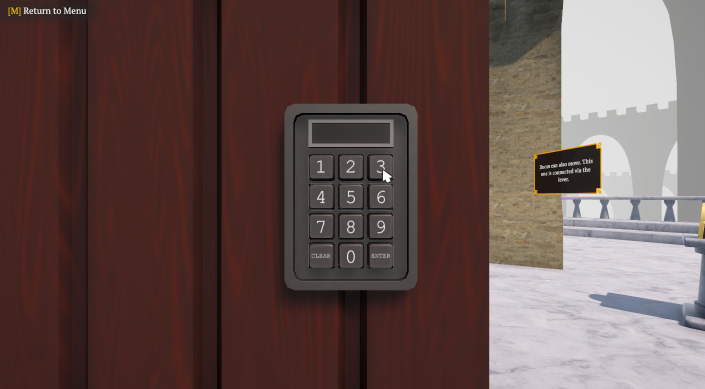
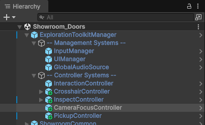
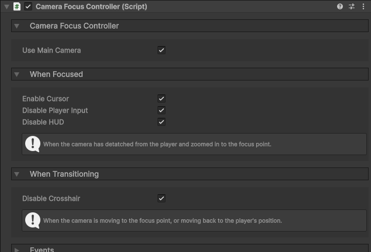
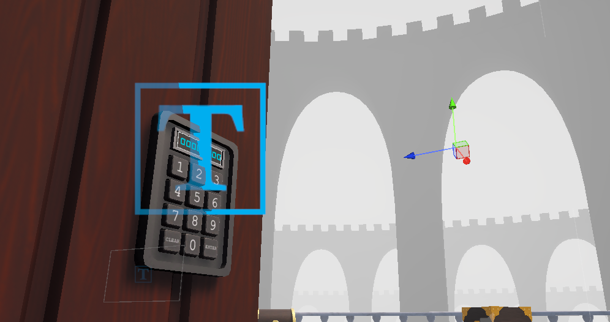
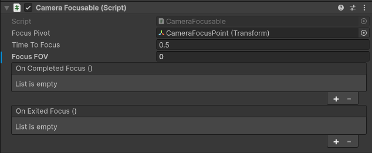
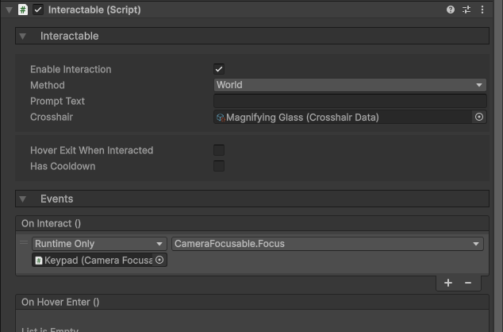

icon: material/image-filter-center-focus-weak

# :material-image-filter-center-focus-weak: Camera Focusing

You might want the camera to zoom in on a keypad, or focus in on something to allow further interaction.

## Setup

### 1. Camera Focus Controller

In order to have the camera detatch and move towards where you want, the **CameraFocusController** is required to be in the scene. The prefab for that is located in the `Core > Prefabs > Systems > Controllers` folder. Drag that in the scene as a child of the **ExplorationToolkitManager**.

In the Inspector, you can adjust the properties to fit your game style.

* Disable `Use Main Camera` if you don't want the main camera to be the one focusing. This will then allow you to reference whatever camera you want.
* The `When Focused` properties determine what gets enabled/disabled during the focus state.
* The `When Transitioning` properties determine what gets enabled/disabled during the movement to and from the focus point.

### 2. Focusable

With the controller setup, you can now define some focusables. These are the actual things the camera will be focusing on.

To begin, create an empty GameObject (ideally as a child of the thing you're planning to focus on), and position it where you want the camera to move to. The Z (blue) direction will be the camera's forward facing direction.

Next, on the object you want to focus on, add the **CameraFocusable** component.

* Assign the empty GameObject you just created as the `Focus Pivot`.
* The `Time to Focus` is how many seconds it takes for the camera to transition.
* The `Focus FOV` determines what field of view the camera will change to upon focusing. A value of 0 means the FOV won't change.
* With the events, you might want to enable some interactions upon focusing and disable them upon exiting the focus.

Now in order to trigger the focus, you need to call the **CameraFocusable**'s `Focus()` function. Most of the time, this will be triggered upon interacting with something. So on the object you wish to focus the camera on, attach an [Interactable](../interaction/basic-setup.md) component, and connect its `OnInteract` event with the focusable's `Focus()` function.

