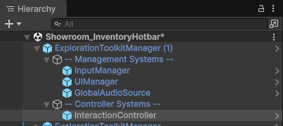
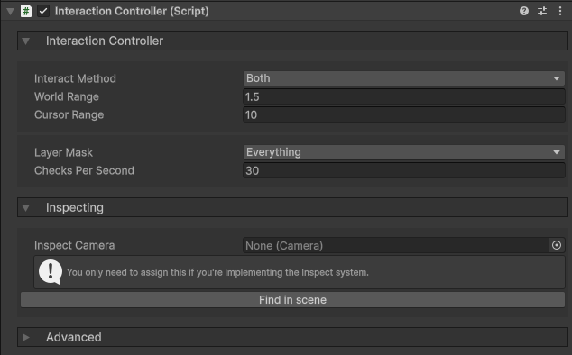
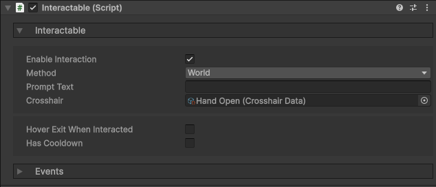

icon: material/gesture-tap-hold

# :material-gesture-tap-hold: Basic Setup

## What is an Interaction?

When you look at an object or hover your mouse over an object, certain things can happen. You could interact with a door to open it, click on a keypad button to enter the number, or interact with a lever to pull it.

With the default controls, an interaction occurs when you're looking at an **Interactable** and click the left mouse button.

## Setup

### 1. Interaction Controller

In order to interact with objects in the world, you need to have an **InteractionController** in the scene, as a child of the **ExplorationToolkitManager** object.

By default, the **ExplorationToolkitManager** prefab has this controller included, so there's no need to add it manually.

Looking in the Inspector, there are a few things we can go over to better understand this component.

* The `Interact Method` defines what types of interactions are supported. Check out the section below for more info.
* `World Range` is the max distance from the camera a *World* interaction can occur.
* `Cursor Range` is the max distance from the cursor's world position a *Cursor* interaction can occur.
* `Checks Per Second` defines the rate at which raycasts will be emitted to detect interactables. You may want to limit this if you're experiencing performance issues, but overall the system is well optimized.
* If you are implementing the [Inspect](../interaction/inspect-objects.md) system, assign your inspect camera here, or click *Find in scene* to automatically reference the inspect camera.

### 2. Interactables

Now that we have the interaction controller, we need actual objects to interact with. If you want the player to be able to interact with something, simply attach the **Interactable** component, and a collider to define the interaction bounds.

* If you are using the [Crosshair](../player/crosshairs.md) system, you can set a `Crosshair` to display when hovering over this Interactable. That could be a door icon when looking at a door, or an open hand when looking at an item to pickup.
* `Has Cooldown` allows you to limit the rate at which it can be interacted with.
* As of now, `Prompt Text` does nothing. This system will be implemented in the future.

## Interact Methods

On the **Interactable** component, you may notice there's an `Interact Method` property. There are 3 types of interactions that can occur and you can filter Interactable components to detect all or one of them.

| Method | How it Detects |
|-|-|
| **World** | When you aim the center of the camera at something. E.g. opening a door, picking up an item. |
| **Cursor** | When you hover the mouse cursor over something. E.g. clicking buttons in a keypad when the camera is zoomed into it. |
| **Both** | Checks for both *World* and *Cursor* interactions |

For example, let's say you have a puzzle box. You might have an **Interactable** (with the *World* method) on the box for the player to look at and interact to open the inspect screen. With the mouse now enabled, you might have smaller interactables (with the *Cursor* method) for the player to click on.