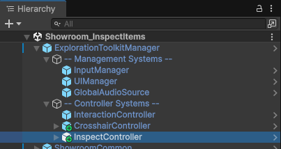
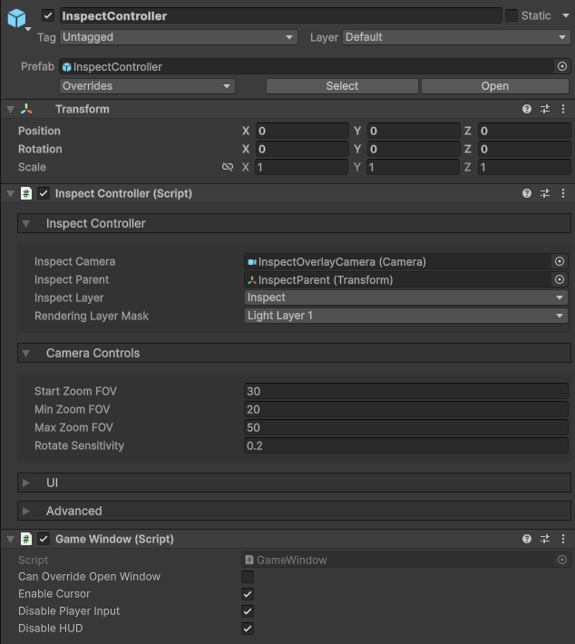
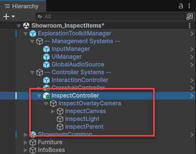
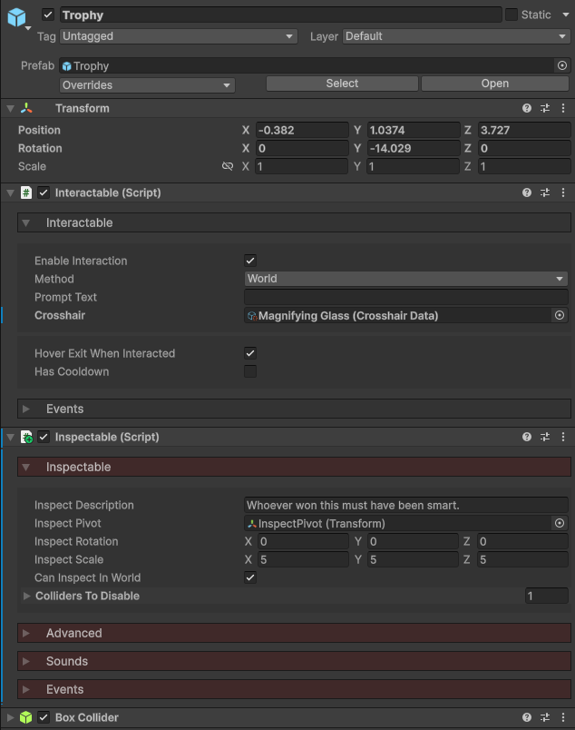

icon: material/magnify

# :material-magnify: Inspect Objects

You can interact with objects to inspect them. This will open the inspect screen, where you can rotate, zoom, and further interact with the object. This is good for puzzle games where you may want to read notes, or for implementing puzzle boxes.

<iframe width="854" height="480" src="https://www.youtube.com/embed/ymIhazdEbPg" frameborder="0" allow="accelerometer; autoplay; encrypted-media; gyroscope; picture-in-picture" allowfullscreen></iframe>

## Setup

### 1. Inspect Controller

The **Inspect Controller** works in tandem with the [Interaction Controller](../interaction/basic-setup.md), checking to see what the player is looking at. If it's an **Inspectable**, then upon interaction, the inspect screen will open, and the object will be setup for inspection.

Add the **InspectController** prefab to your scene, located in the `Core > Prefabs > Systems > Controllers` folder, and make it a child of the **ExplorationToolkitManager**.

!!! question "Why make it a child of the ExplorationToolkitManager?"
    The **ExplorationToolkitManager** is what registers all the systems we wish to use in the scene. Learn more about it [here](../setup/scene-setup.md#exploration-toolkit-manager).

In the Inspector, we can configure our inspect system.

* The `Inspect Camera` is what gets enabled when we enter the inspect screen. We'll go over how that works next.
* The `Inspect Parent` is an empty GameObject which the Inspectable object will be made a child of.
* You can also define the layer and rendering layer mask which will be applied to the Inspectable object. This is what the `Inspect Camera` renders.
* You can adjust the camera controls for the inspect screen, field of views and rotate speeds.
* The **GameWindow** component is used to define properties related to being in the inspect screen. Learn more [here](../ui/ui-manager.md).

Now let's explore the children objects of the **InspectController** prefab.

* **InspectOverlayCamera** - The camera which toggles when entering/exiting the inspect screen. This is an *Overlay* camera (so make sure to add it to your main camera's stack), which only renders the *Inspect* layer.
* **InspectCanvas** - UI canvas with the background, text elements and buttons.
* **InspectLight** - Directional light which illuminates only the inspected object. You can adjust the brightness, color, etc here.
* **InspectParent** - The empty GameObject which the Inspectable object will become a child of. This is what we rotate when moving our mouse in the screen.

!!! note
    If you have not already setup the *Inspect* layer, you must do so in order to use this system. The inspected object is rendered on a separate layer so it overlays everything else in the scene. Learn how to set that up [here](../setup/importing.md#layer-setup-required).

### 2. Inspectable

The **Inspectable** component marks a GameObject as available to be inspected by the player. For an object to be inspected, it requires 3 components:

1. **Interactable** - Used to detect when the player is looking at the object.
2. **Inspectable** - The component we're learning about now.
3. **Collider** - Any sort of collider to define the interaction bounds.

The component has a number of properties we can explore.

* The `Inspect Description` is the text displayed at the bottom of the screen when inspecting.
* By default, the object will rotate around its Transform's origin. You can create an empty GameObject child and assign that to `Inspect Pivot` to adjust it.
* `Inspect Rotation` is the starting local rotation.
* Some objects will appear to small or too big when inspecting, so you can adjust their `Inspect Scale`.
* If you want the player to be able to inspect an object by interacting with it in the world, enable `Can Inspect in World`.
* To mitigate any issues with collision, drag all the object's colliders into the `Colliders to Disable` list.

## Technical Overview

There are a few steps in the process of inspection.

1. The player interacts with an **Inspectable**, triggering an inspection.
2. The inspect camera is enabled, displaying the canvas and other children objects.
3. The **Inspectable** is made a child of the `Inspect Parent`.
4. The **Inspectable** has its and all its childrens' layers changed to *Inspect*, so it will be renered by the inspect camera.
    * The original layers are cached and will be reset upon exiting the inspection.
5. The **Inspectable** has its and all its childrens' MeshRenderers rendering layers changed to `Rendering Layer Mask`. This makes it so the inspect light only illuminates the inspected object.
6. Player input is disabled via the [UI Manager](../ui/ui-manager.md), and the mouse is enabled.
7. Upon exiting, the reverse of these steps happen.