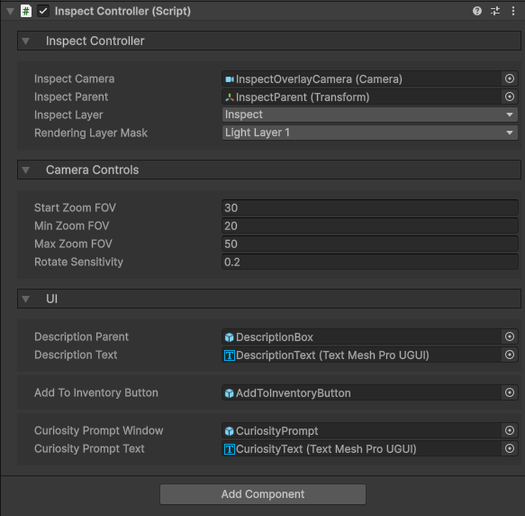
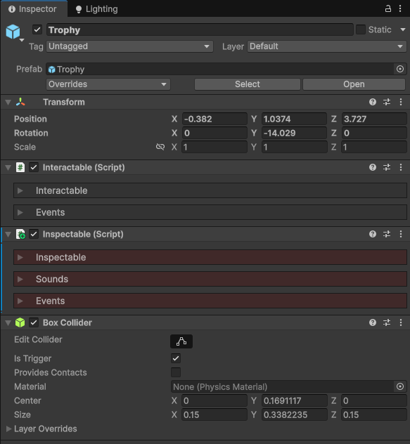
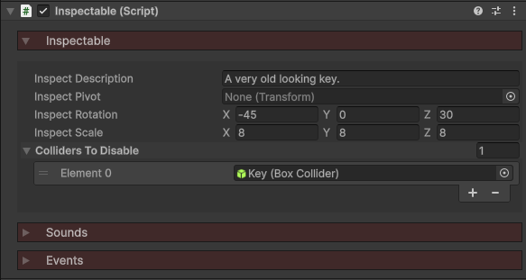

icon: material/magnify

# :material-magnify: Inspect Objects

You can interact with objects to inspect them. This will open the inspect screen, where you can rotate, zoom, and further interact with the object. This is good for puzzle games where you may want to read notes, or for implementing puzzle boxes.

YOUTUBE VIDEO

All objects you wish to inspect must have a **Inspectable** component. You also need an **Inspect Controller**, which manages the overall system.

## Inspect Controller

The inspect controller works side by side with the [Interaction Controller](../interaction/basic-setup.md) to identify what you're looking at. If it's an inspectable, it can then be inspected. The controller can also be manually triggered to inspect something, e.g. in lockpicking.

1. Add the **InspectController** prefab to your scene, located in the `Core > Prefabs > Systems` folder.
2. Reference this in your player's [Player Components](../player/player-components.md) object.

## How it works

When you inspect an object, the following happens:

1. The inspect camera is enabled. This is an overlay camera which renders the inspected object, as well as corresponding UI.
2. The inspectable object has its Tranform moved down to the inspect parent, and made a child of it.
3. The inspectable and all of its children have their layer changed to *Inspect*. This is because the inspect camera only renders this layer.
4. The inspectable and all of its children MeshRenderers have their rendering layers changed to *Light Layer 1*. This is because we have a separate directional light which illuminates only the inspected object.

Then, when the inspection is exited, the opposite happens; layers are reset and the object goes back to its original location/state.

## Inspectable

The Inspectable component marks a GameObject as available to be inspected. This can be a note, puzzle box, important item, anything!

For an Inspectable to work, it requires 3 components:

1. **Interactable** - This allows the object to be looked at/hovered over, leading to a possible inspection.
2. **Inspectable** - The component we're learning about now.
3. **Collider** - Any sort of collider for the interaction controller to detect.

Inside the Inspectable component, there are a few properties of note:

* **Inspect Pivot** - You can change the rotation pivot point of the object with an empty GameObject.
* **Inspect Rotation** - Starting rotation that will be set when inspecting the object. Showcase their good side.
* **Inspect Scale** - Many objects are small and show up tiny on the screen when inspected. Adjust this accordingly.
* **Colliders to Disable** - You have have colliders or triggers that could interfere when inspecting. These will be disabled while the inspection takes place.

