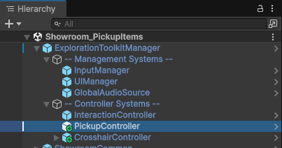
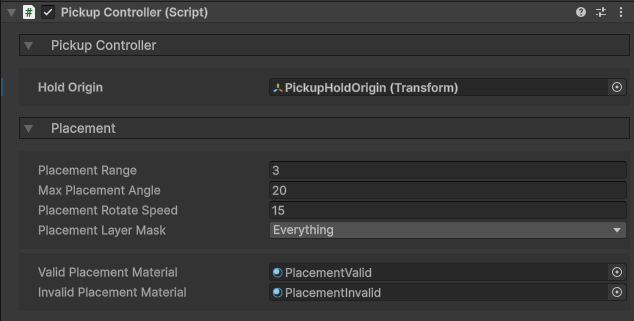
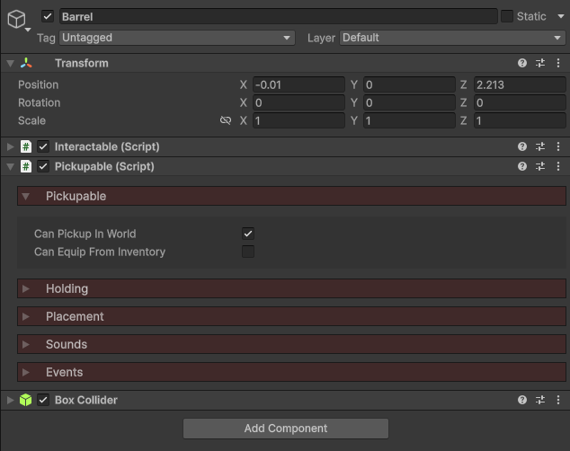
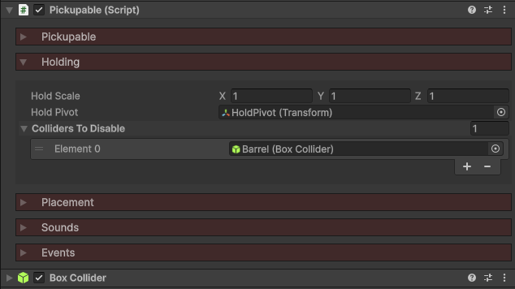
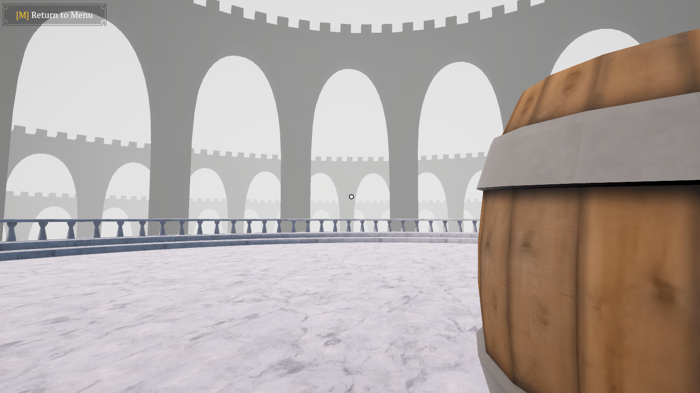
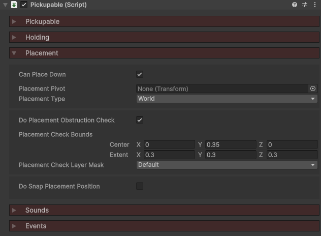
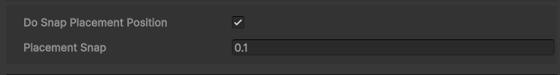
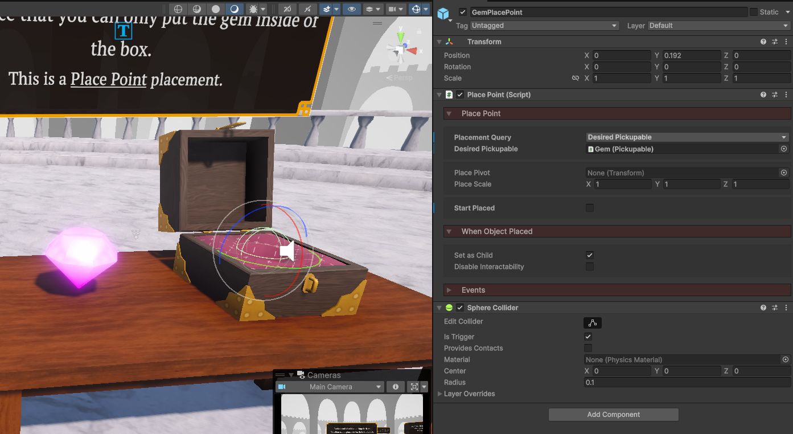
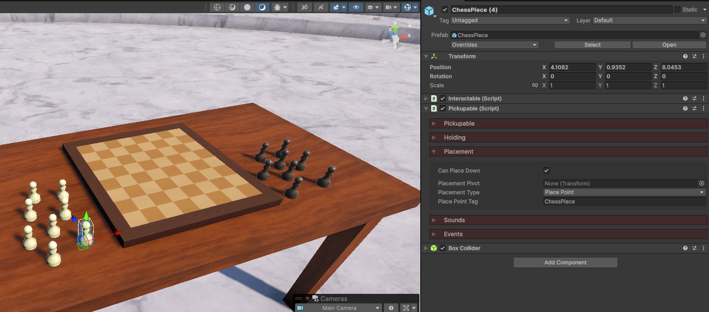

icon: material/package-variant-closed

# :material-package-variant-closed: Pickup Objects

You can interact with an object to pick it up and hold it in your hands. These objects can be used as keys to open doors, weapons to shoot, puzzle pieces to place in the right position, etc.

<iframe width="854" height="480" src="https://www.youtube.com/embed/twvd5nhh8yI" frameborder="0" allow="accelerometer; autoplay; encrypted-media; gyroscope; picture-in-picture" allowfullscreen></iframe>

## Setup

### 1. Pickup Controller

The **Pickup Controller** works in tandem with the [Interaction Controller](../interaction/basic-setup.md), checking to see what the player is looking at. If it's a **Pickupable**, then upon interaction, the object will be placed in the player's hand.

Add the **PickupController** prefab to your scene, located in the `Core > Prefabs > Systems > Controllers` folder, and make it a child of the **ExplorationToolkitManager**.

!!! question "Why make it a child of the ExplorationToolkitManager?"
    The **ExplorationToolkitManager** is what registers all the systems we wish to use in the scene. Learn more about it [here](../setup/scene-setup.md#exploration-toolkit-manager).

In the Inspector, we can configure our pickup system.

* `Hold Origin` is the empty GameObject which held items will be parented to. This should be a child of your camera. The included player controller prefab has this GameObject already created.
* The other settings are for placing down the currently held pickupable. We'll be going over that part of the system later.

### 2. Pickupable

The **Pickupable** component marks a GameObject as available to be picked up by the player. For an object to be picked up, it requires 3 components:

1. **Interactable** - Used to detect when the player is looking at the object.
2. **Pickupable** - The component we're learning about now.
3. **Collider** -  Any collider which is used to define the interaction bounds.

The component itself has a number of different sections which we'll be going over. The first, has a couple of properties.

* Enable `Can Pickup in World` if you want to be able to interact with this object to pick it up. Most of the time, you'll want this, unless it's an item you want to only equip from the inventory.
* Enable `Can Equip From Inventory` if you're planning to have this object be added to the player's inventory and want them to be able to equip it. Learn more about how to set that up [here](../inventory-items/items.md).

## Holding

If your hand is empty and you interact with a **Pickupable**, it will be placed in your hand (moving, rotating and parenting it to the `Hold Origin`).

In the Inspector, you can adjust the holding properties.

* If you want the object to be of a different scale once held (you might want to shrink large objects or size up smaller ones), adjust the `Hold Scale` vector.
* By default, the object will be held from the Pickupable's Transform origin. If you want to adjust where the object is held from, create an empty GameObject child and assign that to the `Hold Pivot`.
* To mitigate any un-wanted collision when holding, you can drag the object's colliders into the `Colliders to Disable` list.

Here's what it looks like when the player is holding a barrel (from the `Showroom_PickupItems` demo scene). I've added a `Hold Pivot` so the barrel is not being held from the base, but from the center.

## Placement

When an object is in your hand, you may be able to place it back down in the world.

There are two placement types you can choose from.

| Type | How it Works |
|-|-|
| **World** | Freely place the object on any surface as long as there are no obstructions. |
| **Place Point** | Snap the object to a pre-defined Place Point |

### World Placement

Under the *Placement* section, enable `Can Place Down`, and set `Placement Type` to *World*.

Now with the object in your hand, you can hold down `E` to preview where it will go. If the placement is valid and you release `E`, the object will be removed from your hand and return to the world.

* By default, the object will be placed at its Transform origin. If you wish to change this, create an empty GameObject and drag that into the `Placement Pivot` property.

You can make the object only placeable if there are no obstructions in the way, by enabling `Do Placement Obstruction Check`.

In the scene view, you will now see an orange rect which defines the check bounds. When placing the object, if any colliders (filtered by the `Placement Check Layer Mask`) are inside, the placement will be invalid.

To know if a placement is valid or invalid, while holding down `E` to place, the object's materials will change to one of two as seen below. These materials can be changed in the **PickupController** component.

<figure markdown="span">
{:style="height:300px"}
<figcaption>Invalid Placement</figcaption>
{:style="height:300px"}
<figcaption>Valid Placement</figcaption>
</figure>

By default, wherever you are looking will be the point at which the object will be placed. Enabling `Do Snap Placement Position` will round that position to the nearest `Placement Snap`. This is good for placing on a grid.

### Place Point

With the object in your hand, you can now specific points at which it can be placed down. This in turn, could trigger events, such as placing a statue on a pressure pad, or construcing a puzzle.

This is done by defining **Place Points**.

1. Create an empty GameObject.
2. Attach the **PlacePoint** component.
3. Attach a collider.

Let's explore some of the componen's properties.

* `Placement Query` defines what can be placed here.

| Query | About |
|-|-|
| Desired Pickupable | Only the `Desired Pickupable` can be placed on this point. Good for a puzzle game where a place might need to find a certain object and place it down on the correct slot. |
| Tag | Only pickupables with the matching `Tag` can be placed on this point. Good for something like a chess board, or pedestals which can hold a variety of things. |

* By default the pickupable will be placed on the point's Transform origin. You can create an empty GameObject and set that as the `Place Pivot` to adjust that.
* If you want the places object to have a different scale, adjust the `Place Scale`.
* If `Start Placed` is true, the `Desired Pickupable` will be in a placed state upon initialization (doesn't work for tag placement).
* If you want the pickupable to be parented to the place point when placed, enable `Set as Child`.
* `Disable Interactivity` will disable the pickupable's colliders and pyhsics when placed down.

Under the *Placement* section of the **Pickupable**, enable `Can Place Down` and set the `Placement Type` to *Place Point*.

With the object in your hand, you can now define specific points at which it can be placed down. This in turn, could trigger events, such as placing a statue on a pressure pad, or construcing a puzzle.

* By default the object will be placed based on its Transform origin. You can create an empty GameObject and set that as the `Placement Pivot` to adjust that.
* The `Place Point Tag` is what's used to check if a place point can hold this object, if that point's query is set to *Tag*.

<figure markdown="span">

<figcaption>This is the Pickupable for a gem which is to be placed in a box.</figcaption>

<figcaption>This is the Pickupable for a chess piece, which can be placed on any place point with the tag "ChessPiece".</figcaption>
</figure>