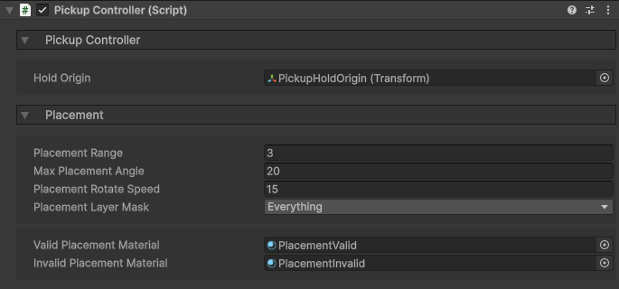
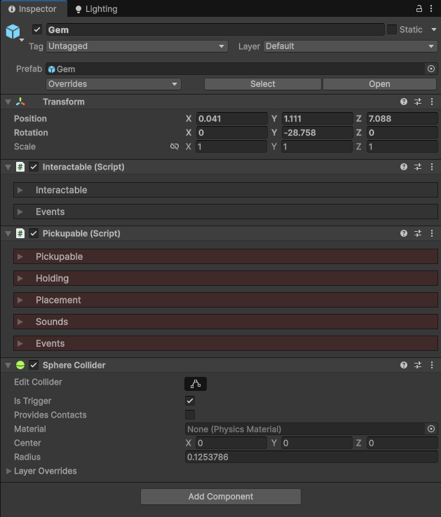
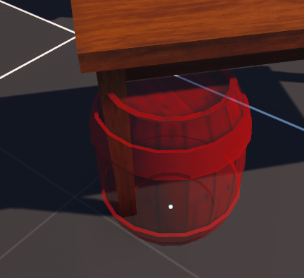
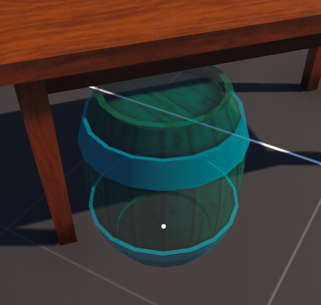
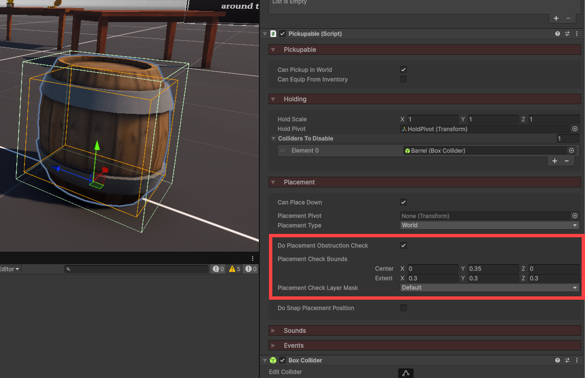
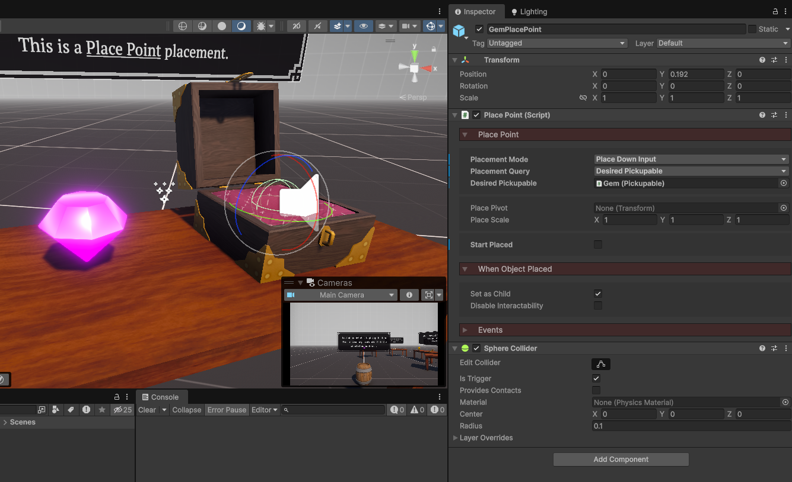
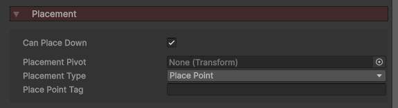
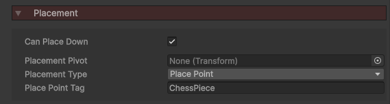

# Pickup Objects

You can interact with an object to pick it up and hold it in your hands. These objects can be used as keys to open doors, weapons to shoot, puzzle pieces to place in the right position.

YOUTUBE VIDEO

All objects you wish to pickup must have a **Pickupable** component. You also need a **Pickup Controller**, which manages the overall system.

## Pickup Controller

The pickup controller works side by side with the [Interaction Controller](../interaction/basic-setup.md) to identify what you're looking at. If it's a pickupable, it can then be placed in your hand.

1. Add the **PickupController** prefab to your scene, located in the `Core > Prefabs > Player Systems` folder.
2. Reference this in your player's [Player Components](../player/player-components.md) object.

You can then assign a Hold Origin transform, which will be where the picked up object will be placed and parented. The other properties are to do with placement, which we'll go over in a bit.

## Pickupable

The Pickupable component marks a GameObject as available to be picked up. This can be anything; a key, torch, gun, crate, etc.

For an object to be picked up, it requires 3 components:

1. **Interactable** - This allows the object to be looked at/hovered over, leading to a possible pickup.
2. **Pickupable** - The component we're learning about now.
3. **Collider** - Any sort of collider for the interaction controller to detect.

### Holding

If your hand is empty and you interact with a Pickupable, it will be placed in your hand (you are now holding it).

You can connect functionality to the `OnUse` event. This can be used to shoot the gun in your hand, toggle the torch on/off, etc.

### Placement

When an object is in your hand, you may be able to place it back down in the world.

There are 2 types of placement:

* **World** - Freely place the object on any surface as long as there are no obstructions.
* **Place Point** - Snap the object to a pre-defined place point.

Hold `E` to preview the object placement, release to confirm the placement.

#### World Placement

When placing in the world, the PickupController will shoot out a raycast to determine where the object should go. It will then leave your hand and appear as a placement preview in the world. The material will temporarily be changed, blue for a valid placement, or red for an invalid placement (the specific materials can be changed in the PickupController component).

<figure markdown="span">
{:style="height:300px"}
<figcaption>Invalid Placement</figcaption>
{:style="height:300px"}
<figcaption>Valid Placement</figcaption>
</figure>

The object can only be placed if these criteria are met:

* The object must not be on too steep of a slope, as defined by the PickupController's *Max Placement Angle*.
* The object must not be obstructed, as defined by the Pickupable's *Placement Check Bounds*.

* You can also enable snapping, so when placing an object, it will snap to whatever unit you set (1 meter, 0.1 meters, etc).
* When placing an object, you can use the scroll wheel to rotate it along the Y axis for precise control over not just placement position, but orientation too.

#### Place Point

If you want an object to be placed in a specific location (or a number of possible locations), you can use a place point.

To create a place point, attach the **PlacePoint** component to an empty GameObject, as well as a collider.

A place point can have one of two queries:

* **Desired Pickup** - Assign a specific Pickupable object which is to be placed here.
* **Tag** - Define a tag, which on the Pickupable you can also set. This makes it so the Pickupable can only be placed on place points of the corresponding tag.

On an object's Pickupable component, you want to enable *Can Place Down*, and set the *Placement Type* to Place Point.

<figure markdown="span">

<figcaption>This is the Pickupable for a gem which is to be placed in a box.</figcaption>

<figcaption>This is the Pickupable for a chess piece, which can be placed on any place point with the tag "ChessPiece".</figcaption>
</figure>