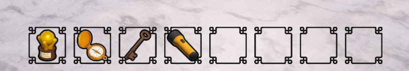

icon: material/table-row

# :material-table-row: Hotbar Inventory

A hotbar inventory displays items at the bottom of the screen. You can scroll with the mouse wheel to select a slot, and if that item is equippable, it will be equipped.

## Setup

First, make sure you have setup an [Inventory Controller](../inventory-items/inventory-controller.md).

To add a hotbar inventory, simply drag the **InventoryHotbar** prefab into your scene, which is located in the `Core > Prefabs > Inventories` folder.

!!! note
    The GameObject does not need to be a child of the **ExplorationToolkitManager**, as this is not a registered system.