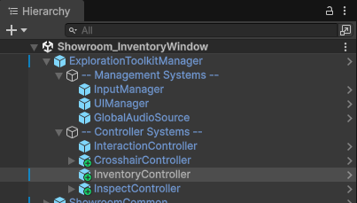
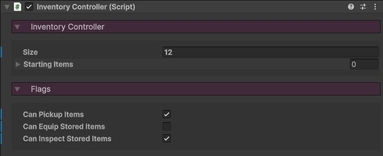

icon: material/bag-suitcase

# :material-bag-suitcase: Inventory Controller

The **InventoryController** is what manages the player's items, adding them, equipping them, removing them, etc.

## Setup

Add the **InventoryController** prefab to your scene, located in the `Core > Prefabs > Systems > Controllers` folder. Make this a child of the **ExplorationToolkitManager**, as this will automatically register it, allowing it to be accessed by either the hotbar or window inventory.

In the Inspector, define the inventory `Size`. This is how many items slots the inventory will have.

* The `Starting Items` is a list of ItemData files, which will be added to the inventory upon initialization.
* `Can Pickup Items` will allow the player to interact with items in the world to add them to the inventory.
* `Can Equip Stored Items` will allow the player to equip an item in the hotbar inventory once selected.
* `Can Inspect Stored Items` will allow the player to inspect an item in the window inventory once clicked on.

From here, you can choose to implement either a [Hotbar Inventory](../inventory-items/hotbar-inventory.md), or a [Window Inventory](../inventory-items/window-inventory.md).