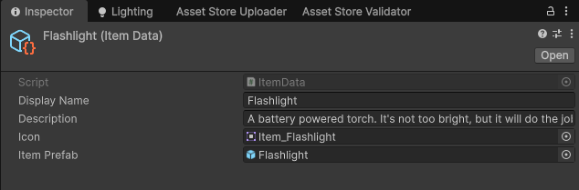
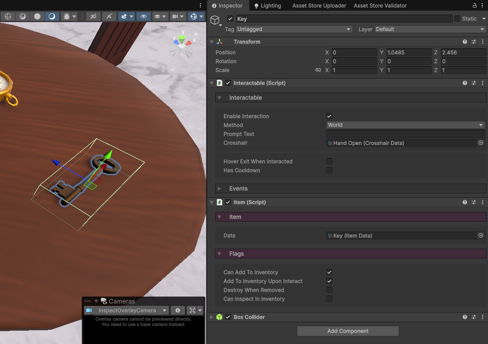
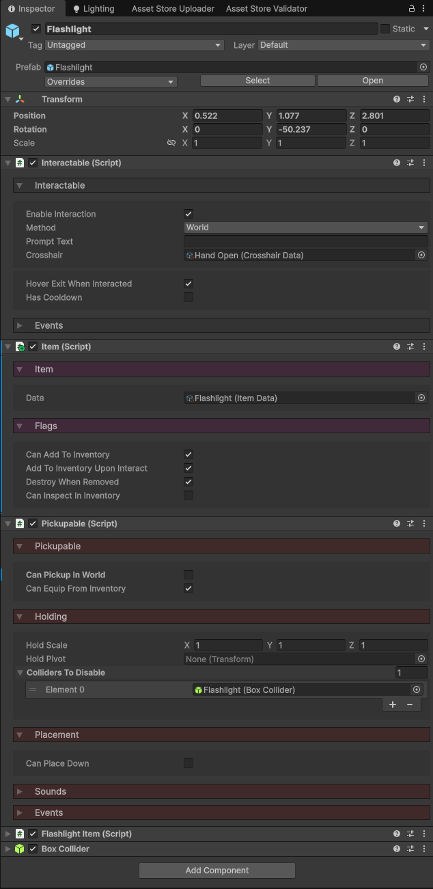
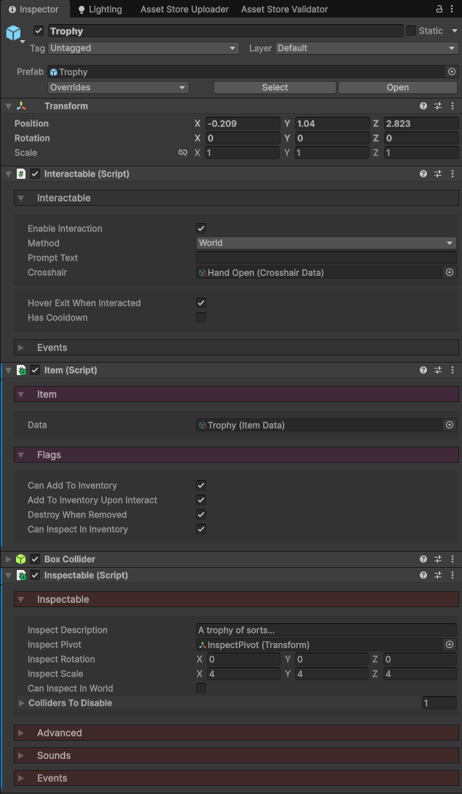

icon: material/tag-outline

# :material-tag-outline: Items

In your game, you might want items for the player to pickup and add to their inventory. In the toolkit, items are represented by ScriptableObjects, and instanced with GameObjects. This method means item stacking, as of now, is not present in the toolkit. But for puzzle games where the player's progression can be tracked via what they are holding, this method works just fine.

## Creating an Item

### 1. Item Data

You first need to create an **ItemData** ScriptableObject. This is what's used to define what kind of an item a GameObject is.

Right click in the Project window and select `Create > Exploration Toolkit > Item Data`.

* Give your item a `Display Name` and `Description`.
* The `Icon` is a sprite which is what's rendered in the inventory.
* The `Item Prefab` is optional, but recommended. This is what we're going to cover in the next section. You will need to include this, if the item is given to the player *not* via an interaction with the item in-game.

### 2. Item GameObject

What gets added to your inventory is not the ItemData, but a GameObject with the **Item** component attached.

Create a GameObject with a visual for the item as a child, then attach these 3 components:

1. **Interactable**: Used to detect interactions by the player.
2. **Item**: Defines this GameObject as an item, something that can be added to the inventory.
3. **Collider**: Any type of collider to define the bounds of the interaction.

In the image below, I have an example of a *key* item.

On the **Item** component, there are a few properties to look at.

* All Items need the `Data` property assigned to their respective ItemData file.
* `Can Add to Inventory` determines if this item can be added to the player's inventory. Most of the time, you'll want this enabled.
* `Add to Inventory Upon Interact` will add this item to the inventory when the player interacts with it, thus, no functions need to be connected to the **Interactable**'s `OnInteract` event.
* `Destroy When Removed` will delete the GameObject when removed from the player's inventory.
* `Can Inspect in Inventory` will allow the item to be inspected from inside a [Window Inventory](../inventory-items/window-inventory.md). This requires an [Inspectable](../interaction/inspect-objects.md) component to be attached.

## Equippable Items

Items such as torches, or compasses, or weapons can be equipped by the player from their inventory. For this to work, the item GameObject must have a [Pickupable](../interaction/pickup-objects.md) component attached (as well as the pickup system implemented).

Here's a look at the components which make up a flashlight item. Make sure that in the **Pickupable** component, disable `Can Pickup in World` (so the item gets added to the inventory and not held straight away), and enable `Can Equip From Inventory`.

!!! note
    As of now, equipping items from the inventory can only be done when using the [Hotbar Inventory](../inventory-items/hotbar-inventory.md).

## Inspectable Items

You might want to inspect items in your inventory for further analysis. For this to work, the item GameObject must have an [Inspectale](../interaction/inspect-objects.md) component attached (as well as the inspect system implemented).

Here's a look at the components which make up an item you can inspect in the inventory. Make sure that on the **Item** component, `Can Inspect in Inventory` is enabled, and on the **Inspectable** component, `Can Inspect in World` is disabled (this will prevent any conflict between inspecting and adding to inventory upon initial interaction).

!!! note
    As of now, inspecting items in the inventory can only be done when using the [Window Inventory](../inventory-items/window-inventory.md).

