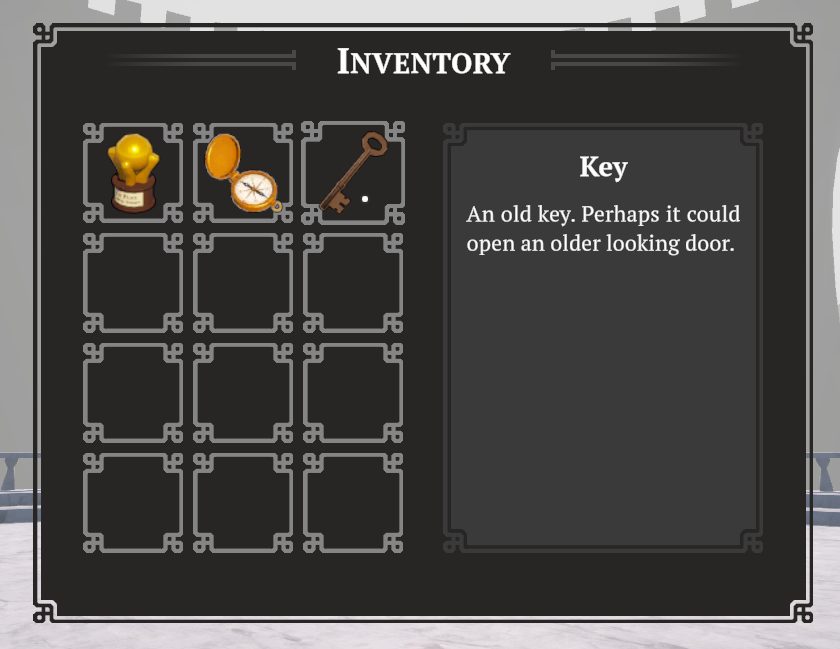

icon: material/view-grid-outline

# :material-view-grid-outline: Window Inventory

A window inventory displays items in a toggleable window (by default, the `Tab` button). You can hover over these items to display their name and description on the right hand side, and if setup, even inspect them.

## Setup

First, make sure you have setup an [Inventory Controller](../inventory-items/inventory-controller.md).

To add a window inventory, simply drag the **InventoryWindow** prefab into your scene, which is located in the `Core > Prefabs > Inventories` folder.

!!! note
    The GameObject does not need to be a child of the **ExplorationToolkitManager**, as this is not a registered system.