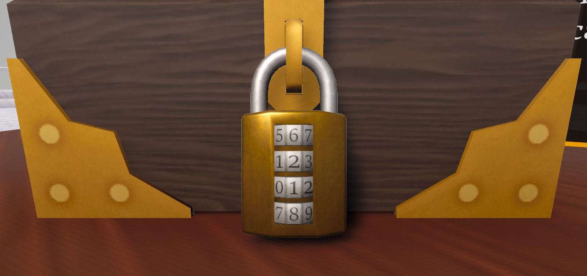
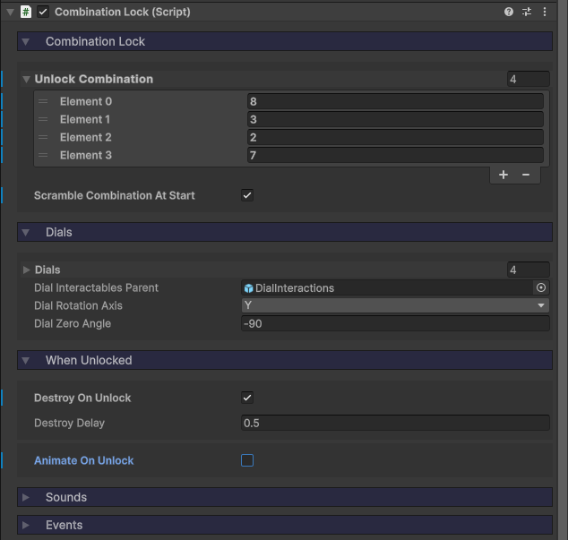
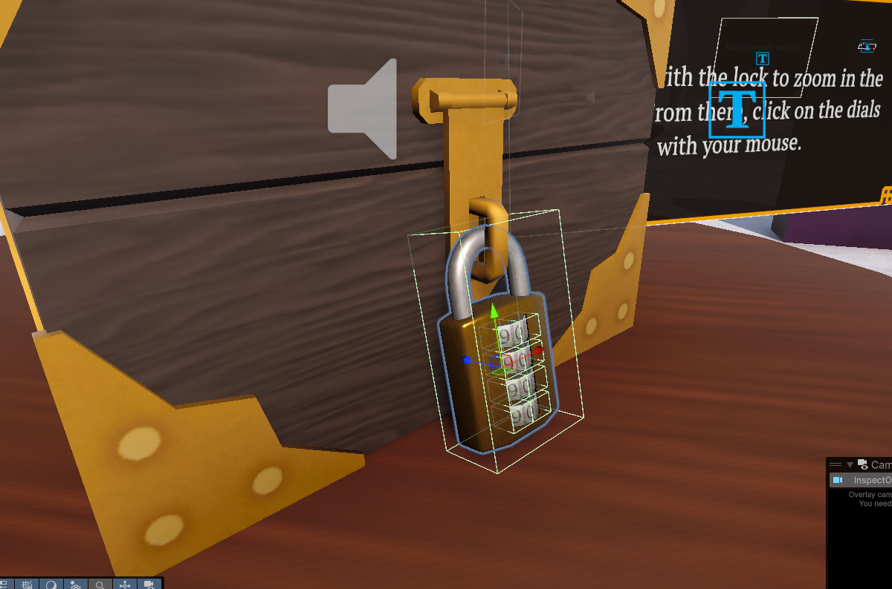
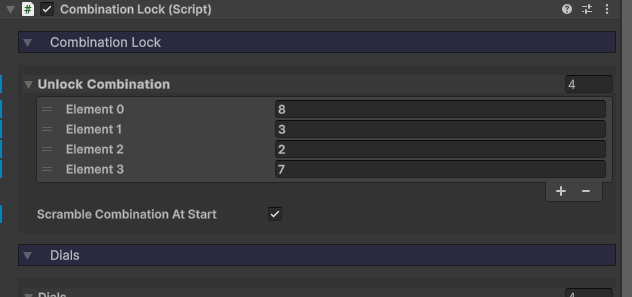
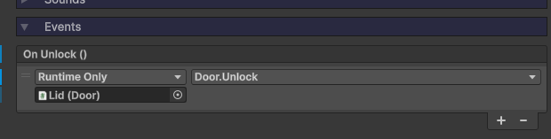

icon: material/lock-percent-outline

# :material-lock-percent-outline: Combination Locks

Combination locks are interactables which allow the player to turn dials in order to enter the correct code. These can be useful for locking containers, doors, or any kind of puzzle element.

## Setup

### 1. Prefab

If you go to the `Implementation > Prefabs > Locks` folder, you will see the **CombinationLock** prefab. Drag that into your scene and put it wherever you wish. If it's purpose is to lock a container of sorts, I recommend making it a child of that object.

!!! note
    By default these locks have the camera zoom in on them, so make sure you have correctly setup the [Camera Focusing](../camera/camera-focusing.md) system first.

### 2. Configuration

In the Inspector, we can configure some properties.

* The `Unlock Combination` is an array of numbers, defining the required value of each dial to unlock.
* If `Scramble Combination at Start` is true, the dials will be randomly turned upon initialization (don't worry, it won't accidently set the unlock combination). If false, you can manually define a starting combination.
* The `Dials` list contains all of the Transforms for the dial objects. You can adjust their rotation axis and zero angle (angle in degrees at which 0 is displayed) below.
* The `Dial Interactables Parent` is the GameObject which contains all of the individual **Interactables**, which the player can click on to turn. By default this is disabled, and only enabled when the camera focuses on the lock.
* `Destroy On Unlock` will destroy the lock GameObject once unlocked, after `Destroy Delay` seconds has elapsed.
* `Animate On Unlock` will allow you to play an animation once unlocked (animating the lock opening or something).

## Unlocking a Box

Let's look at how we can connect a combination lock to a box. This would be ideal for puzzle game.

1. Drag the **Gem Box** prefab into your scene, located in the `Implementation > Prefabs > Containers` folder
2. Implement the [Camera Focusing](../camera/camera-focusing.md) system.
3. Drag in the **Combination Lock** prefab, located in the `Implementation > Prefabs > Locks` folder. Make it a child of the box.

    

4. In the Inspector, define an `Unlock Combination`.

    

5. For the combination lock's `OnUnlock` event, connect that to the `Unlock()` function on the gem box's [Door](../mechanisms/doors.md) component.

    