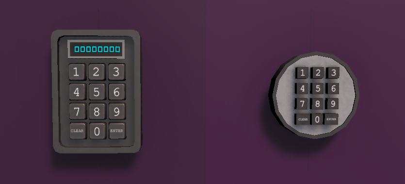
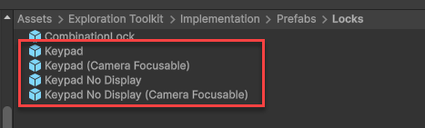
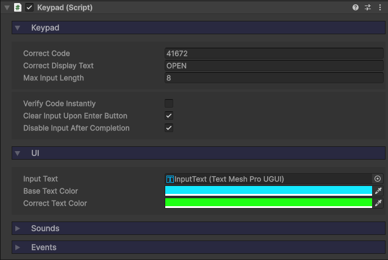
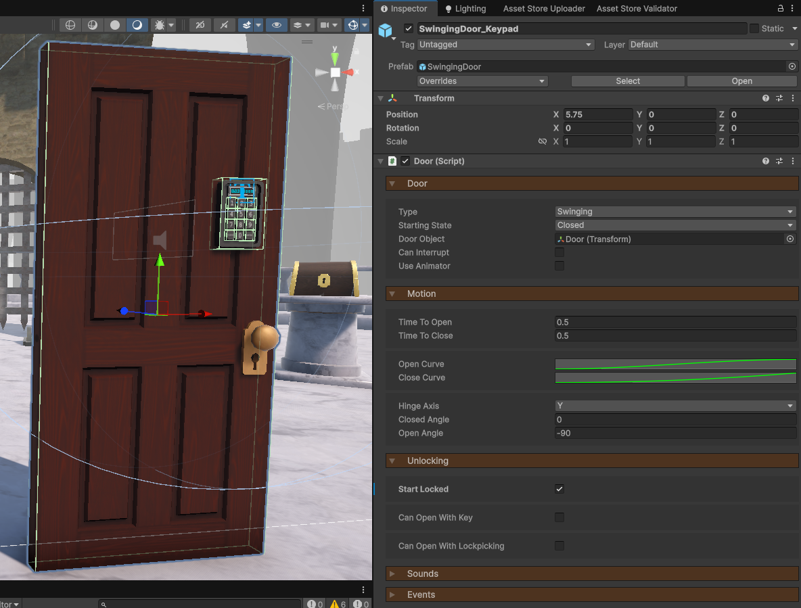
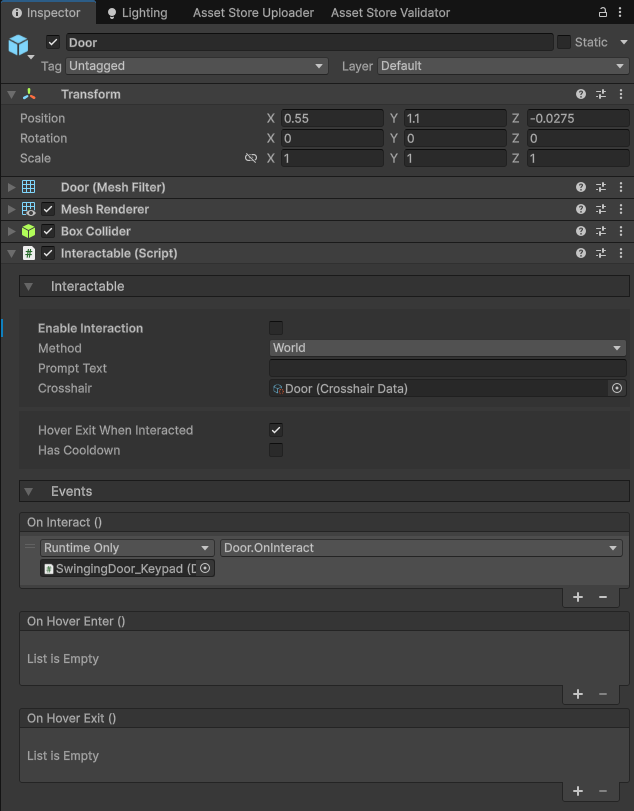
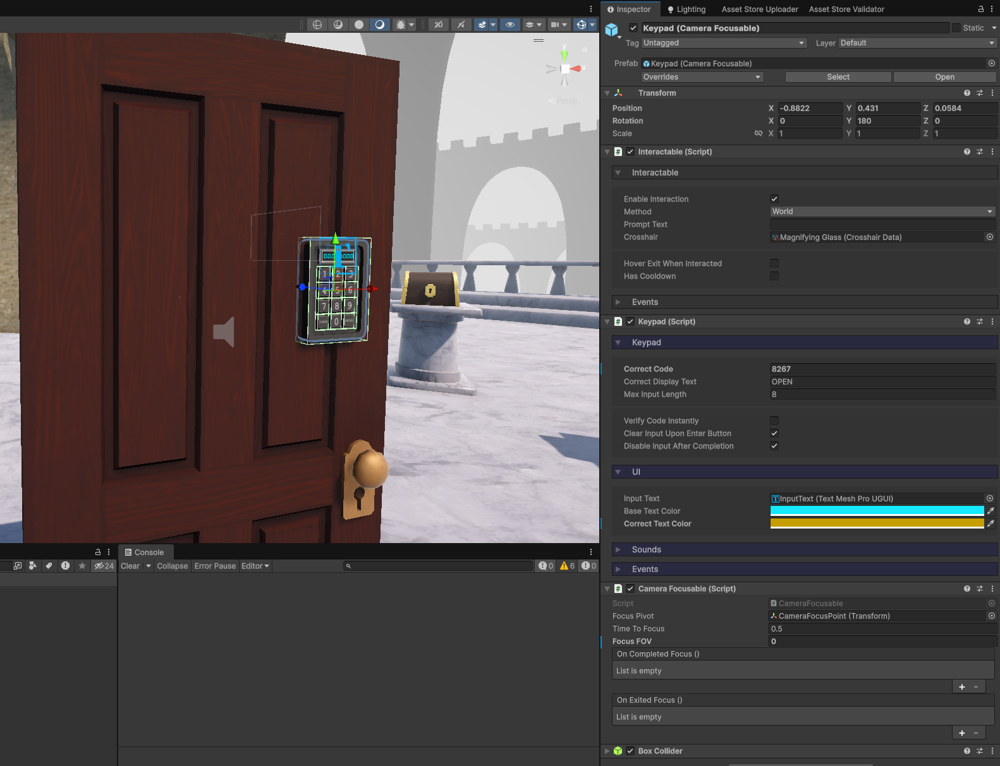
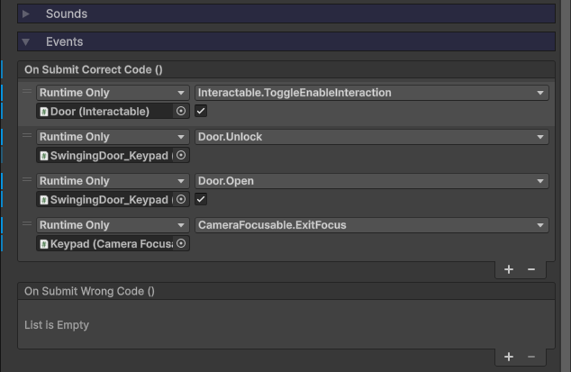

icon: material/dialpad

# :material-dialpad: Keypads

Keypads are interactables which allow the player to input a numerical code via buttons. These can be useful for locked doors, safes, or any other kind of puzzle.

## Setup

### 1. Prefab

If you go to the `Implementation > Prefabs > Locks` folder, you will see a number of different keypads which you can implement.

There are two main types: **Keypad** and **Keypad (No Display)**.

They are both constructed in the same with, with the only difference being one doesn't have a UI display to show the code input and messages.

Each keypad also has a [Camera Focusable](../camera/camera-focusing.md) variant. Here's how they differ:

* **Keypad** - The player looks at each button, interacting with them to register an input.
* **Keypad (Camera Focusable)** - The player interacts with the keypad to zoom the camera in, where they then use the mouse to click on the buttons. If you wish to use this type of keypad, make sure you have setup [camera focusing](../camera/camera-focusing.md).

### 2. Configuration

In the Inspector, let's have a look at the **Keypad** component.

* `Correct Code` is what the player must enter in order to unlock the keypad.
* `Correct Display Text` is the text that gets displayed when the keypad is unlocked (this is only used for the keypad with a display).
* `Max Input Length` is the max amount of numbers the player can enter in a single string.
* If you want the keypad to unlock the moment the correct code has been entered, enable `Verify Code Instantly`, otherwise they will need to click the *ENTER* button.
* If `Clear Input Upon Enter Button` is true and the player clicks *ENTER*, the current input will be cleared.
* `Disable Input After Completion` will disable the keypad once the correct code has been entered.
* `Base Text Color` is the color of the display text by default.
* When the correct code has been entered, the text color will change to `Correct Text Color`.

## Unlocking a Door

Let's look at how we can connect a keypad to a door.

1. Create the [Door](../mechanisms/doors.md) iteself, making sure to enable `Start Locked`.

    

2. On the GameObject which rotates and which the player interacts with, disable `Enable Interaction`, because at first, we don't want the door to open or close, or attempt to unlock via key, etc.

    

3. Drag the **Keypad (Camera Focusable)** into the scene as a child of the door object. You can also use the non-camera focusable version if you wish.
    * Assign a `Correct Code`.

    

4. Down in the **Keypad**'s `OnSubmitCorrectCode` event, connect these functions:
    * `Interactable.ToggleEnableInteraction(true)` - Allow the player to now interact with the door.
    * `Door.Unlock()` - Unlocks the door.
    * `Door.Open(true)` - Opens the door (you might not want the door to open automically upon unlock too).
    * `CameraFocusable.ExitFocus()` - Stop focusing on the keypad (if using the camera focusable version).

    

