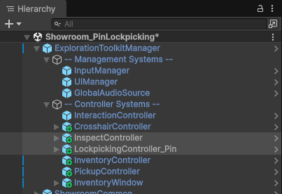
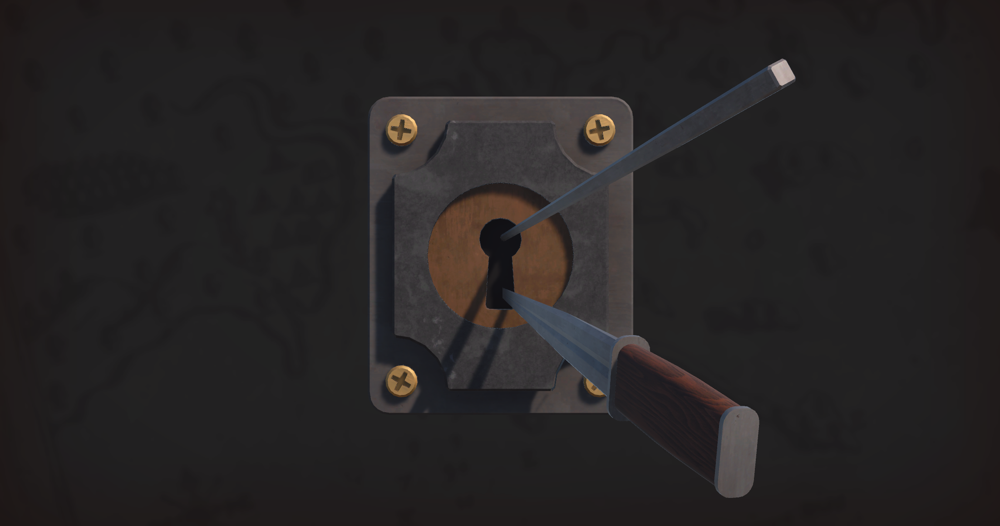
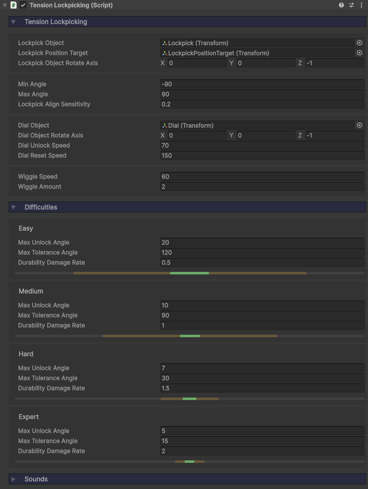
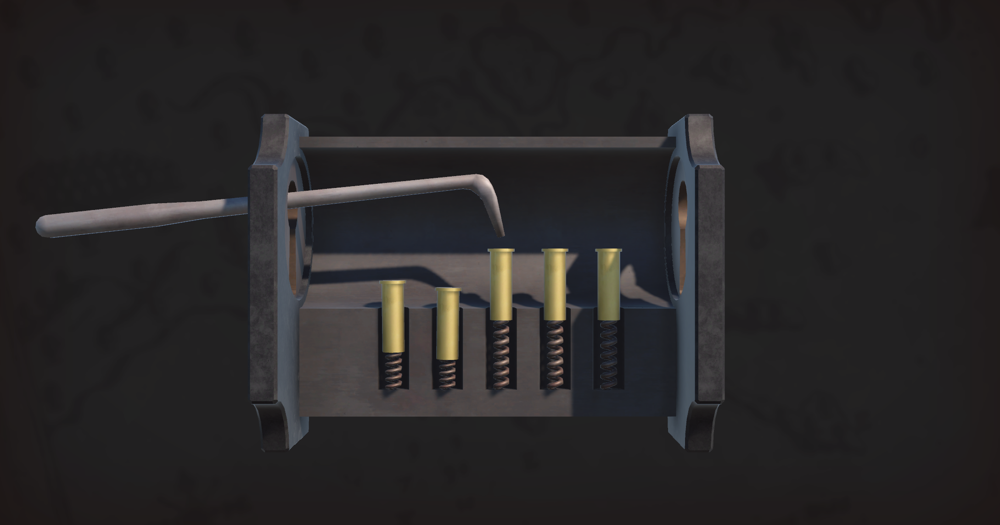
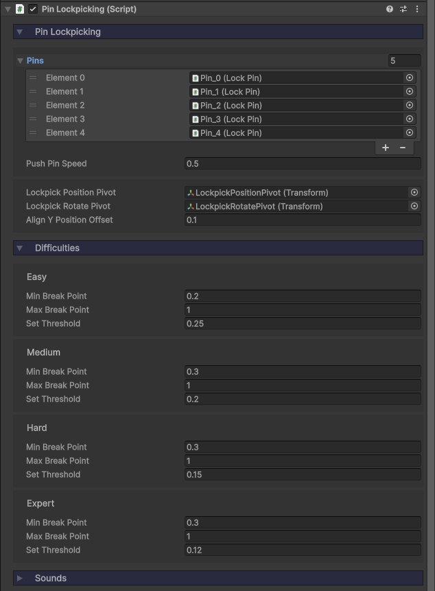
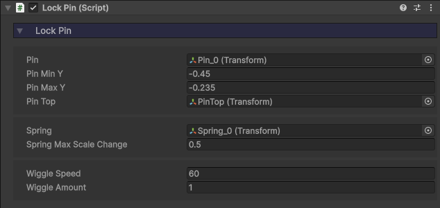
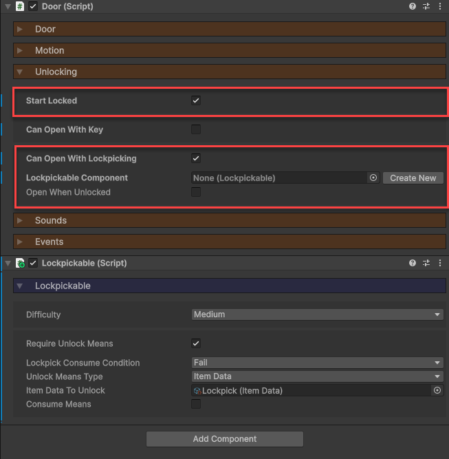

icon: material/knife-military

# :material-knife-military: Lockpicking

The toolkit features two lockpicking mini-games, which can be triggered upon interacting with a [Door](../mechanisms/doors.md) (or anything else if you wish), and when completed will unlock it. These mini-games are re-creations of existing systems in other games, so hopefully their mechanics are familiar to you.

* **Tension Lockpicking** - Similar to the system in *Skyrim*.
* **Pin Lockpicking** - Similar to the system in *The Elder Scrolls Online*.

## Setup

1. Add one of the **LockpickingController**'s to your scene, found in the `Core > Prefabs > Systems > Controllers` folder, and make it a child of the **ExplorationToolkitManager**.
    * Choose between the *LockpickingController_Tension* and *LockpickingController_Pin*.
2. The lockpicking screen is built upon the [Inspect System](../interaction/inspect-objects.md), so you also need to add an **InspectController**.

## Tension Lockpicking

The goal here is to rotate the lockpick with the mouse in an attempt to find the sweet-spot. Press `D` to try and turn the lock. If the pick is in the sweet-spot, it will turn all the way and unlock. Otherwise, the lock may turn somewhat (the further it turns, the closer you are) then begin to wiggle. If you let the lock wiggle too much, the pick will break.

* Higher difficulties shrink the sweet-spot angle, the max tolerance angle, and the rate at which the lockpick is damaged.
* Similar to the lockpicking in *Skyrim*.

Here's a look at the **TensionLockpicking** component, which runs the whole show. For the most part, I recommend leaving most of the properties alone, unless you plan on replacing the models with your own custom ones.

Let's go over some of the less obvious properties and what they do.

* The `Lockpick Position Target` is an empty GameObject which is a child of the dial. Since the lockpick enters the keyhole off-center from the center of the dial, the pick needs to move when the dial rotates.
* The `Dial Object` is the keyhole which rotates to the right.
* The two `Rotate Axis` properties are in local space.
* The `Durability Damage Rate` is how much lockpick damage accumulates per second when the lock is wiggling. Once that number reaches 1, the lock breaks. So a damage rate of 0.5 will give you 2 seconds of total wiggle time before breakage.

!!! note
    There is also an [Inspectable](../interaction/inspect-objects.md) component attached. This is because the lockpick window is controlled via the inspect system.

## Pin Lockpicking

The goal here is to set all five pins. You do this by moving the mouse to select a pin, then holding down the `Left Mouse Button`, watch as the pin is pushed down. The moment it begins to wiggle, let go, and it will be set. If you let a pin wiggle too much, the pick will break.

* Higher difficulties shrink the time between the pin beginning to shake and breaking.
* Similar to the lockpicking in *The Elder Scrolls Online*.

Here's a look at the **PinLockpicking** component, which runs the whole show. For the most part, I recommend leaving most of the properties alone, unless you plan on replacing the models with your own custom ones.

Let's go over some of the less obvious properties and what they do.

* The lockpick moves via IK, so the `Lockpick Rotate Pivot` is a Transform at the keyhole which only rotates. The `Lockpick Position Pivot` is a child of that (containing the lockpick model) and moves left and right locally.
* The `Align Y Position Offset` determines how high the lockpick hovers above the pins when selecting one.

!!! note
    There is also an [Inspectable](../interaction/inspect-objects.md) component attached. This is because the lockpick window is controlled via the inspect system.

Each of the 5 pins have a **LockPin** component. This controls the movement, spring deformation, wiggle, and state of the pin. These are then all referenced in the **PinLockpicking**'s `Pins` list.

## Lockpicking a Door

If you want to setup a door for lockpicking, do the following:

1. In your [Door](../mechanisms/doors.md) component, enable `Start Locked` and `Can Open With Lockpicking`.
2. Click on the **Create New** button next to `Lockpickable Component`.
3. A [Lockpickable](../locks-lockpicking/unlockables.md) component will be created. Configure it to your liking.

