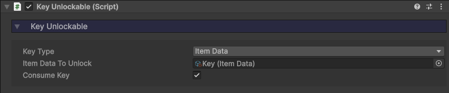
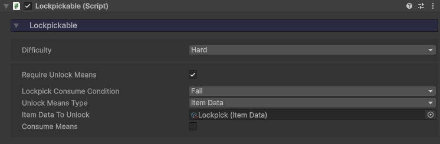

icon: material/key

# :material-key: Unlockables

Doors, crates, and many other things can be locked and require the player to do something in order to open them. That may be a key, a special item, or a lockpicking mini-game.

An **Unlockable** component can consume a key of sorts to unlock. These are most commonly used with **Doors**, but can also be used for your own custom implementations.

There are two types of unlockables you can define:

* **Key Unlockable** - A key object/item/stat will be consumed to unlock this thing.

* **Lockpickable** - A lockpicking mini-game must be completed to unlock this thing. An object/item/stat can also be consumed if the lockpicking fails.

## Key Unlockable

Used to unlock something with a key the player may be in possession of. This could be an old brass key, a keycard, a puzzle piece, etc.

* **Key Type** - What the player needs to have in order to unlock this (Pickupable, Item Data, Stat).
* There will then be a field to assign the respective key. For a Key Type of *Stat*, you can define an amount required to unlock, as well as an amount consumed upon unlock.
* **Consume Key** - Upon unlocking, the key will be destroyed. Pickupable will be destroyed, item removed from inventory, stat reduced.

## Lockpickable

Used to trigger [Lockpicking](../locks-lockpicking/lockpicking.md).

* **Difficulty** - How hard this will be to lockpick (easy, medium, hard, expert).
* **Require Unlock Means** - Does the player need something in order to pick this lock?
* **Lockpick Consume Condition** - At what point will the means be consumed? At the beginning of the attempt, or only upon failiure?
* **Unlock Means Type** - What the player needs to have in order to pick this lock (Pickupable, Item Data, Stat).
* There will then be a field to assign the respective means. For a Unlock Means Type of *Stat*, you can define an amount required, as well as an amount consumed.
* **Consume Means** - Upon unlocking, the means will be destroyed. Pickupable will be destroyed, item removed from inventory, stat reduced.

## Implementation

The components on their own might seem abstract, which is the point as they can be utilized in a wide range of instances. The most common is with doors. You might want a door that locked, and which can only be opened with a key and/or lockpicking.

If you want to use these components with your own custom systems, here's how.

* Call the component's `AttemptUnlock()` function to try and unlock it. This can be connected via an [Interactable](../interaction/basic-setup.md) component.
* If the player was successful in unlocking, the `OnUnlockSuccess` event will invoke, otherwise `OnUnlockFail` will invoke.