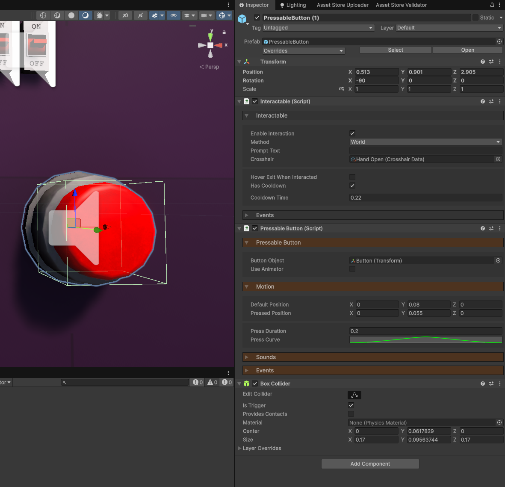
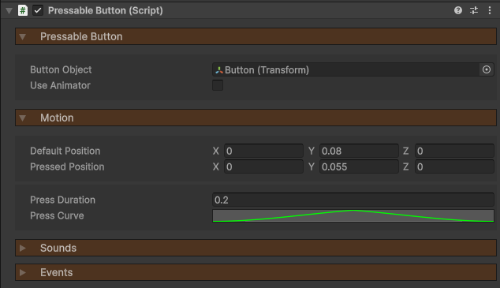
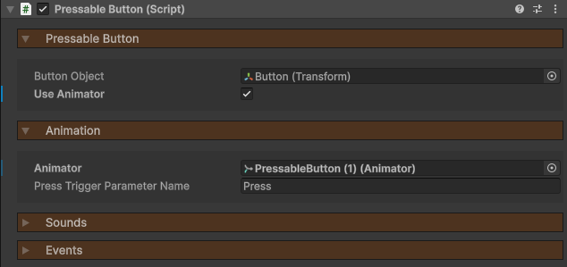

icon: material/flip-vertical

# :material-flip-vertical: Buttons

Buttons are interactables which can trigger an event and animate via scripting or an Animator component.

## Setup

To create a button, you will need 3 components.

1. **Interactable** - Used to detect when the player is looking at the button.
2. **PressableButton** - Trigger the event and animate the button.
3. **Collider** - Any type of collider defining the interaction bounds.

## Animation

By default, the button will be animated via scripting.

1. Assign a `Button Object`, which is what will be doing the moving.
2. You can then define a local `Default Position` and `Pressed Position` for the object to move between.
3. The `Press Duration` is how long the total press animation will take.
4. The `Press Curve` allows you to have smooth movement, or a sudden click then gradual return.

Alternatively, you can choose to animate the button via an Animator component. This can be good if you have multiple objects you wish to animate.

1. Enable `Use Animator`.
2. Reference your Animator components.
3. The `Press Trigger Parameter Name` is the name of the trigger that will be triggered in the Animator when the button is pressed. Implement this in your Animator as you see fit.

## Events

The button has a single event: `OnPress`, which invoked when the button is pressed!