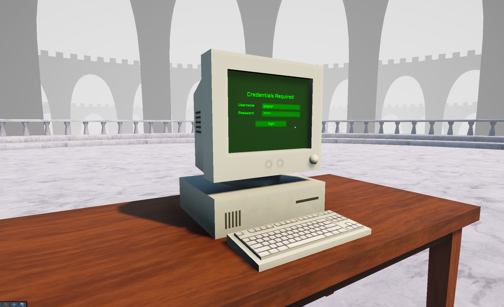
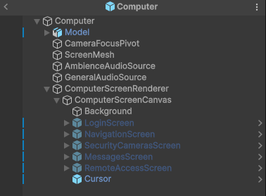
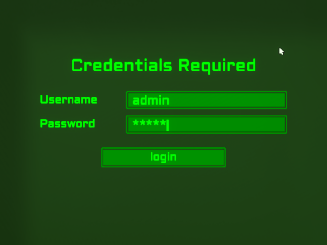
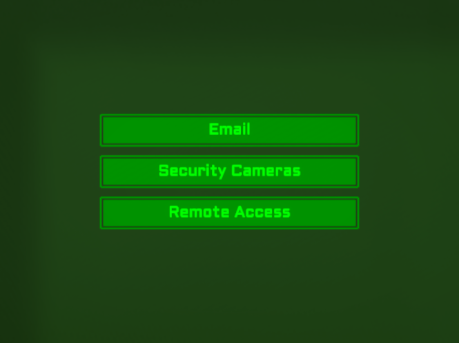
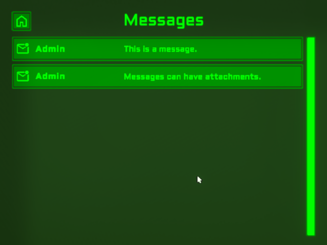
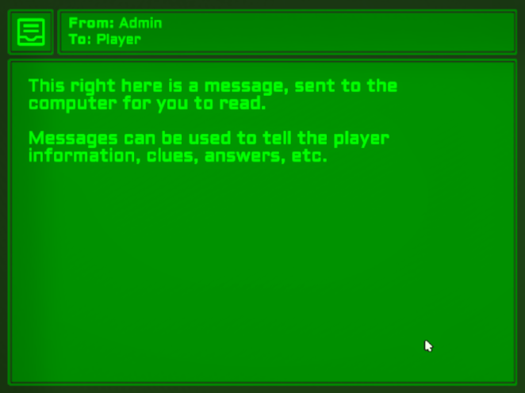
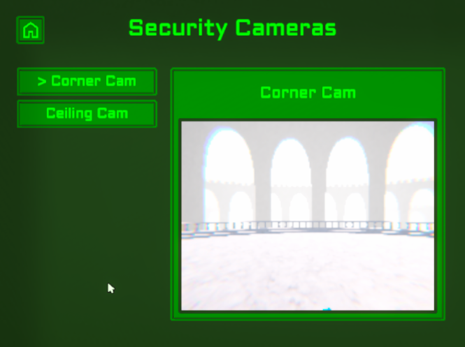
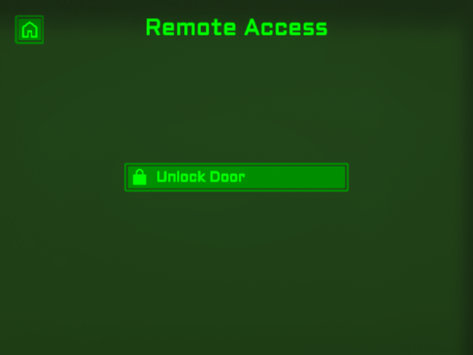

icon: material/desktop-tower-monitor

# :material-desktop-tower-monitor: Computers

Computers are interactable objects which can provide the player information, and/or allow them to interface with the level around them. Computers are made up of screens - login, messages, security cameras, remote access - you can customize what screens the player has access to, and even create your own.

<iframe width="854" height="480" src="https://www.youtube.com/embed/EewhBYwCO40" frameborder="0" allow="accelerometer; autoplay; encrypted-media; gyroscope; picture-in-picture" allowfullscreen></iframe>

## Setup

1. To begin, you will need to add the **ComputerManager** prefab to the scene, making it a child of the **ExplorationToolkitManager**. This can be found in the `Core > Prefabs > Systems > Management` folder. This manages virtual mouse input.

2. The computer prefab is located in the `Implementation > Prefabs > Computers` folder. Drag that into your scene and place it where you want.

3. From here, you can modify the **ComputerController** component to your liking, and customize the screens that make it up.

## Prefab

Let's have a look at the computer prefab. It's got quite a few children, each serving a specific purpose.

* `CameraFocusPivot` - The point at which the camera will move to when [focusing](../camera/camera-focusing.md) on the computer.
* `ScreenMesh` - The quad which displays the screen's render texture.
* `AmbientAudioSource` - The computer plays a looping hum sound via this audio source.
* `GeneralAudioSource` - Sound effects are played through this audio source.
* `ComputerScreenRenderer` - Manages the rendering process (canvas -> render camera -> render texture -> material -> ScreenMesh).
* `ComputerScreenCanvas` - The world space canvas which represents the screens.

## Users

A user is either the player who's interacting with the computer, or someone who sends the player messages. Each user has a username, password, display name, and email address. Not all of these properties are required, but if you want the player to login, they will need a username/password.

Users can be found in the `Implementation > Data > Computer > Users` folder. You can create a new user by right clicking in the Project window and going `Create > Exploration Toolkit > Computer > User`.

!!! info

    You must have a user defined for the player, then on the **ComputerController**, assign it to the `User` property. There is already one by default, so you can just modify the existing *Player* user asset.

## Messages

You can have the player receive messages/emails on the computer. These messages can feature text content, as well as image attachments.

There are a few messages already setup for the demo scenes, which you can find in the `Implementation > Data > Computer > Messages` folder. You can create a new message by right clicking in the Project window and going `Create > Exploration Toolkit > Computer > Message`.

A message requires both a `Sender` and `Receiver` user. The receiver will be the player, and the sender will be whichever character you wish to send the player a message. This could be their friend, their boss, an admin, or a mysterious person.

In the **Computer Controller**, you can define a list of `Starting Messages`, which will be sent to the computer at the start of the game.

## Screens

Screens are the different windows/pages a computer has. There are many built-in screens such as login, navigation, messages/email, security cameras, etc. You can also create your own.

### Login Screen

This screen has input fields for a username and password. In the **ComputerController** component, you can specify if the player needs to login, and if so, whether or not they require both a username and password, or just a password.

The credentials they login with, are specified via **ComputerUser** scriptable object, and assigned to the **ComputerController**'s `User` property.

### Navigation Screen

This is the root screen - the one all back buttons navigate to. Here, the player can choose which screen to view.

### Messages Screen

This is where the messages the computer receieves will be found. They will appear as an inbox message, with both the sender (name or email address), and subject line. The icon to the left will also note if the message has been read by the player or not.

Clicking a message will open it up. At the top, you can see more details about the sender, and the body of the message will be displayed in the large area below. Images can also be sent over with a message.

### Security Cameras Screen

Security cameras can be assigned in the Inspector to appear in this window. When selected, it will activate the camera and preview it on the right hand side.

### Remote Access Screen

Doors and other interactions can be triggered via this window.

### Creating a Screen

1. Open the computer prefab and find the **ComputerScreenCanvas** prefab.

2. Create a new empty GameObject and fill that with the contents of your screen.

3. If your screen has no unique functionality, attach the **ComputerScreenBase** component. Otherwise, you can create a new script, inheriting from **ComputerScreenBase**.

4. In the parent **ComputerController**, add your new screen to the `Screens` list.
    * Here, you can also remove any screens you don't want.

## Rendering

The computer visuals are made with UI elements on a Canvas. They are rendered by a camera unique to each computer and outputted to a Render Texture. This texture is then displayed on a screen mesh.

This method is the best for a number of reasons:

* The UI elements are easier to modify/build upon as they're not scaled down and rotated.
* You can change the Render Texture's resolution and color format to simulate a computer screen.

!!! note

    What this also means, is that the player cannot use their cursor to click on the UI elements, as what they see is merely a texture. Next up we'll go over how the cursor works.

The rendering is all controlled by the **ComputerRenderScreen** component. You'll notice there are properties such as `Master Render Texture` and `Master Material`. These are not the actual assets which are applied and used by the computer, merely templates. At the start of the game, instances of those 2 assets will be made. This allows for multiple computers to be rendering their own screens, without the need to manually create Render Textures and materials for each.

## Cursor

The computers have a cursor which you can control with the mouse, but this is not the actual software cursor. It's a virtual one, made possible only with the Input System, so if you are using an alternative input method for Unity, this component might need to be modified.

## Color Palettes

Different games will require different colors for the computer elements (retro green, black and white, modern blues, etc). You can go ahead and manually change the colors of the default layout, but there's an easier option if you wish to still implement the look of the default layout.

A **ComputerColorPalette** defines what colors are used for the different swatches in the UI (background, primary, text, etc). These can be found in the `Implementation > Data > Computer > Color Palettes` folder. You can also create your own by right clicking in the Project window and going `Create > Exploration Toolkit > Computer > Color Palette`.

To assign a color palette, select the computer, go to the *Screens* section, and drag it in to the **Color Palette** property.

If you go through the computer UI prefabs, you will see that many of them have a **ComputerUIElement** component. This is what defines the specific swatch for that element. Do note, that for a swatch color to be used, the GameObject must have either an **Image** or **TMP_Text** component attached.