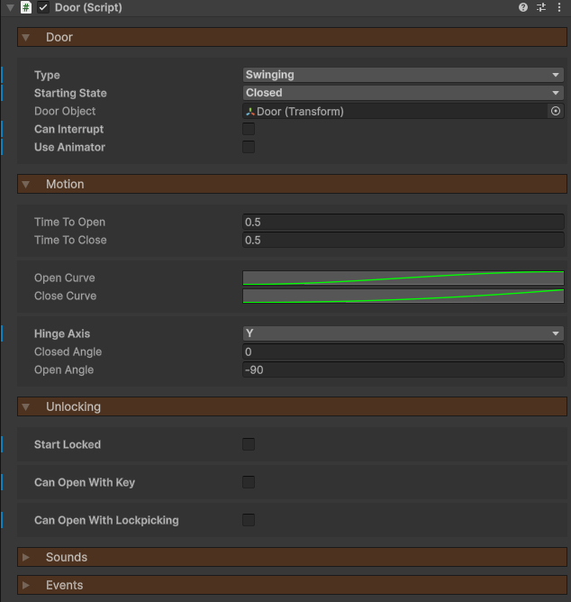
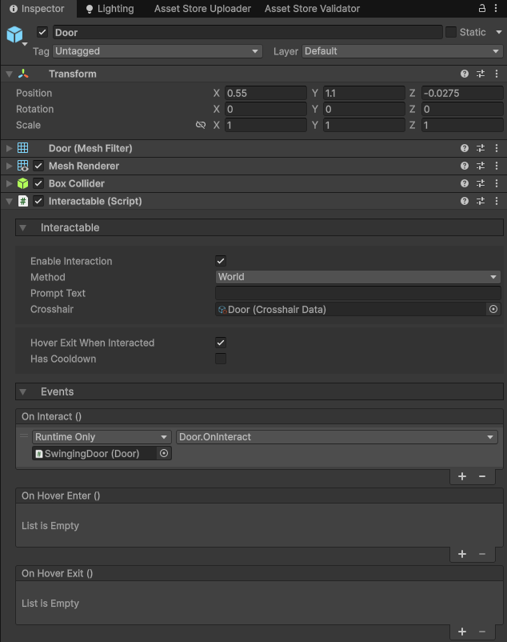
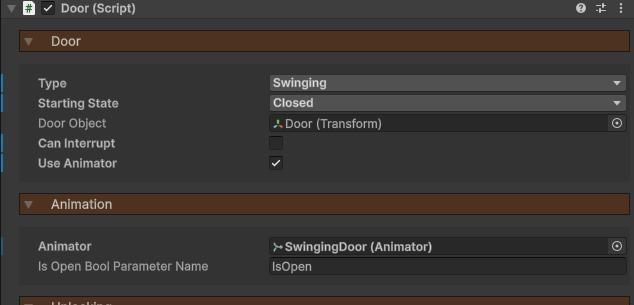
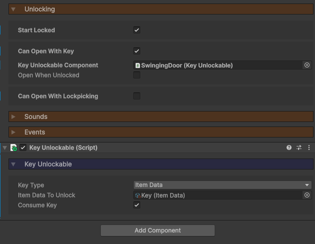
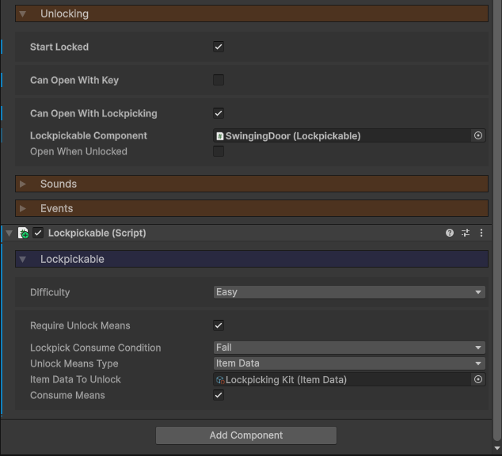
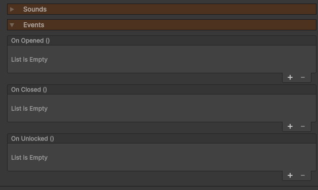

icon: material/door

# :material-door: Doors

Doors are interactable objects which can open and close, be locked, unlocked with a key, or lockpicked. There's quite a bit to them, so let's look at how to set one up.

## Setup

To create a door, attach the **Door** component to your GameObject. Where you put this component doesn't matter. I'd recommend it being on the root object of your door, and not the actual Transform that will swing.

Now, on the actual GameObject which will be moving, or the means of the player interacting with the door to open it, attach 2 components:

1. **Interactable** - Used to detect when the player is looking at the door.
2. **Collider** - Any type of collider defining the interaction bounds.

Here, I've gone ahead and attached these components to the model of the door. We then want to connect the `OnInteract` event to the door component's corresponding `OnInteract` function. This will not just attempt to open/close the door, but check to see if the player can unlock it first if setup that way.

By default, the door will be animated via scripting.

1. Define the `Type` of door. *Swinging* doors animate their rotation, *Sliding* doors animate their position.
2. The `Starting State` determines if the door starts open or closed.
3. Assign a `Door Object`, which will be the object that's rotated/moved.
4. If `Can Interrupt` is true, the door can change state mid-swing.
5. `Time to Open` and `Time to Close` determine the animation duration.
6. `Open Curve` and `Close Curve` allow you to smooth out the animation.
7. `Hinge Axis` determines the local rotation axis the door will swing around.
8. `Closed Angle` and `Open Angle` determine the local rotation for the closed and open state.

Instead of animating the door via script (which is the default setting), you can choose to connect it to an Animator component. To do this, simply enable `Use Animator`.

The `Is Open Bool Parameter Name` is the boolean parameter the component will toggle on the referenced Animator component. Hook this up however you like to your animation.

## Unlocking

If you want the door to be locked, enable `Start Locked`. This will prevent the player from opening the door.

### Keys

One way of opening the door could be with a key.

1. Enable `Can Open With Key`.
2. Click on the `Create New` button. This will create a new **KeyUnlockable** component, which is where we define the type of key (item, pickupable, stat), as well as if the key is destroyed upon unlocking.

Check out [Unlockables](../locks-lockpicking/unlockables.md) if you want to learn more.

### Lockpicking

Instead, or as well as a key, you can implement lockpicking to open the door.

1. Make sure you have a [LockpickingController](../locks-lockpicking/lockpicking.md) added to your scene.
2. Enable `Can Open With Lockpicking`.
3. Click on the `Create New` button. This will create a new **Lockpickable** component, which is where we define the lockpicking settings (difficulty, item required, etc).

Check out [Unlockables](../locks-lockpicking/unlockables.md) if you want to learn more.

## Events

Doors have 3 possible events that can be invoked.

* `OnOpened` when the door opens.
* `OnClosed` when the door closes.
* `OnUnlocked` when the door is unlocked, either via a key or lockpicking.

