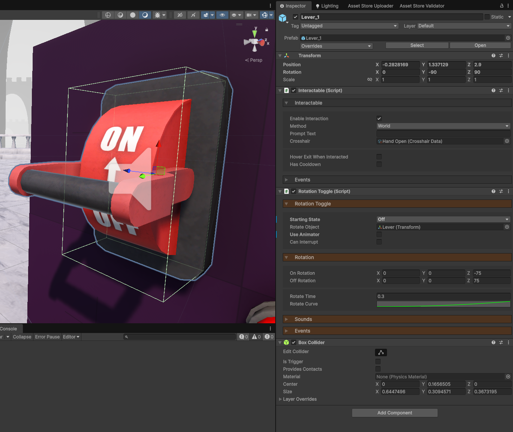
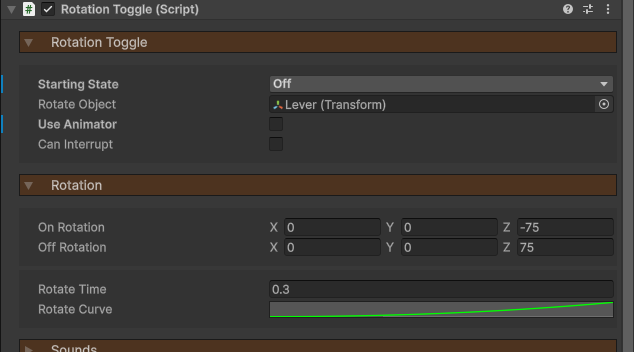
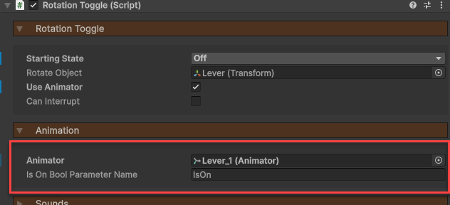
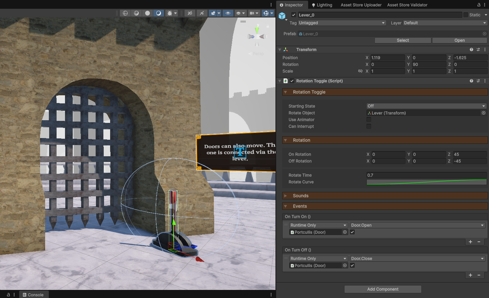

icon: material/turnstile

# :material-turnstile: Levers

Levers are interactables which can switch between an on and off state. You can create 2 types of levers: rotational levers and positional levers. Both function in the exact same way, except that their state is visualized by a difference in rotation and position respectively.

## Setup

To create a lever, you will need 3 components:

1. **Interactable** - Used to detect when the player is looking at the lever.
2. **RotationToggle** or **PositionToggle** - Set the lever's state and updates it visual.
3. **Collider** - Any type of collider defining the interaction bounds.

Do note, the **RotationToggle** and **PositionToggle** components function in almost exactly the same way, so we'll only be looking at the RotationToggle here.

## Animation

By default, the lever will be animated via scripting.

1. Assign a `Rotate Object`, which is what wll be doing the movement.
2. You can then define a local `On Rotation` and `Off Rotation` for the object to rotate between.
3. The `Rotate Time` is how long it takes for the lever to animate.
4. The `Rotate Curve` allows you to have smooth movement, a gradual increase in speed, or whatever you wish.

Instead of rotating the lever via script (which is the default setting), you can choose to connect it to an Animator component. To do this, simply enable `Use Animator`.

The `Is On Bool Parameter Name` is the boolean parameter the component will toggle on the referenced Animator component. Hook this up however you like to your animation.

## Events

Now you probably want your lever to do something instead of just flicking back and forth. In the *Events* dropdown, you can connect the `OnTurnOn` and `OnTurnOff` events to whatever you want. If it's to a door, as in the example below, drag in the Door component and connect to it's `Open` and `Close` functions.

