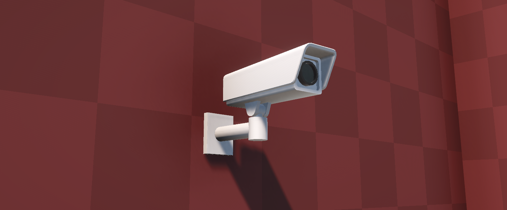
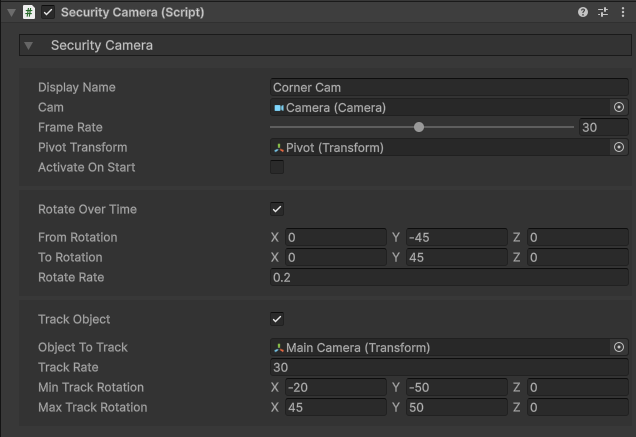
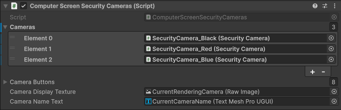
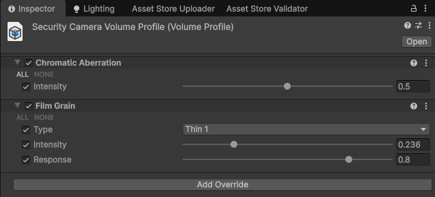

icon: material/video-outline

# :material-video-outline: Security Cameras

Security cameras can both act as a set-piece for your games and render the images they see. This can be great for horror and exploration games, where the player might use a computer to monitor parts of the level.

<iframe width="854" height="480" src="https://www.youtube.com/embed/IZz7JE2_NA8" frameborder="0" allow="accelerometer; autoplay; encrypted-media; gyroscope; picture-in-picture" allowfullscreen></iframe>

## Setup

1. Go to the `Implementation > Prefabs > Security Cameras` folder and drag in your preferred prefab.

2. Modify the properties in the Inspector to your liking. Let's have a look at a few of them now:

    * `Display Name` - The name of the camera when viewed on a computer.
    * `Activate on Start` - Begin rendering the camera when initialized (not recommended for performance reasons).
    * `Frame Rate` - The rate at which an image will be rendered. Lower for better performance and realistic simulation of security cameras.
    * `Do Rotate Over Time` - Pan the camera back and forth. You can define the from and to rotation, as well as the speed.
    * `Do Track Object` - When the specified object is within the min and max track rotation, the camera will rotate to face them.

## Technical

The camera's have been made as performant as possible, rendering an image only when being viewed on a computer, or when specified directly by you with the `Activate()` and `Deactivate()` functions. Performance is also saved in the quality of the camera. Since security cameras are designed for longevity and low memory, you can lower the frame rate and resolution to both save in memory and more closely simulate a real-world camera.

## Viewing on a Computer

1. To view your security cameras on a computer, first add a [Computer](../mechanisms/computers.md) to your scene.
2. Then, navigate to the *SecurityCameraScreen* child object (this is a child of the canvas).
3. In the **ComputerScreenSecurityCameras** component, add the cameras you wish to view on the computer to the `Cameras` list.

## Post-Processing Effects

Security cameras are generally low-quality, grainy, off-colored, and we can simulate this in Unity using post-processing effects. By default, the security camera prefab features a *Sphere Volume*, which is a small, local volume for the camera.

The **Volume Profile** for this is stored in the `Implementation > Data > Security Camera` folder. Add/modify effects to get the look you want. Feel free to create new profiles for individual cameras as well.

## Scripting

There are a couple of interesting things you can do with the security cameras, by calling these functions:

* `Activate ()` - Enable the camera and output to the render texture.
* `Deactivate ()` - Disable the camera and stop outputting to the render texture.
* `IsInView (Bounds bounds)` - Returns true if the requested bounds are within view of the camera.
* `IsInView (Collider collider)` - Returns true if the requested collider is within view of the camera.
* `ChangeTrackedObject (Transform target)` - Assign a new object for the camera to track.