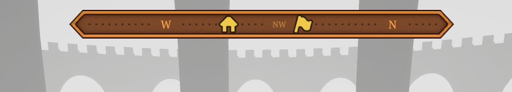
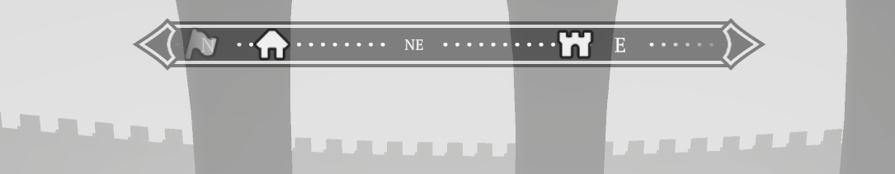
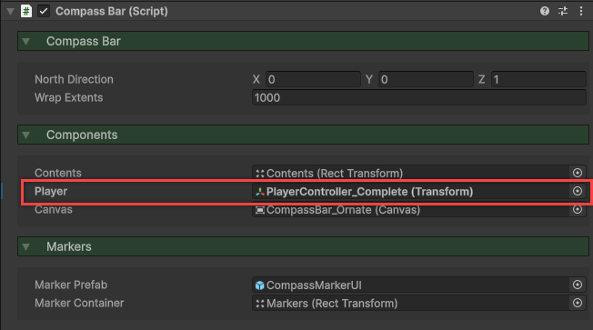

icon: material/compass-rose

# :material-compass-rose: Compass Bar

A UI element which displays the facing direction of the player. If you have implemented [Navigation Markers](navigation-markers.md), they can appear also, leading the player towards them. The toolkit's compass bar is very similar to one you might see in an RPG, such as Skyrim.

<iframe width="854" height="480" src="https://www.youtube.com/embed/FT0eeCKCipg" frameborder="0" allow="accelerometer; autoplay; encrypted-media; gyroscope; picture-in-picture" allowfullscreen></iframe>

## Setup

There are a number of pre-made compass bar prefabs you can use in your game, and modify to fit the theme. These are found in the `Implementation > Prefabs > Navigation > Compass Bars` folder.

1. Drag the prefab into your scene.
2. In the **CompassBar** component, set the *Player* property to be your player object. This is needed for determining the position of the navigation markers.

