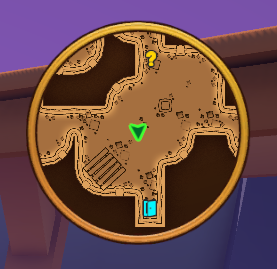
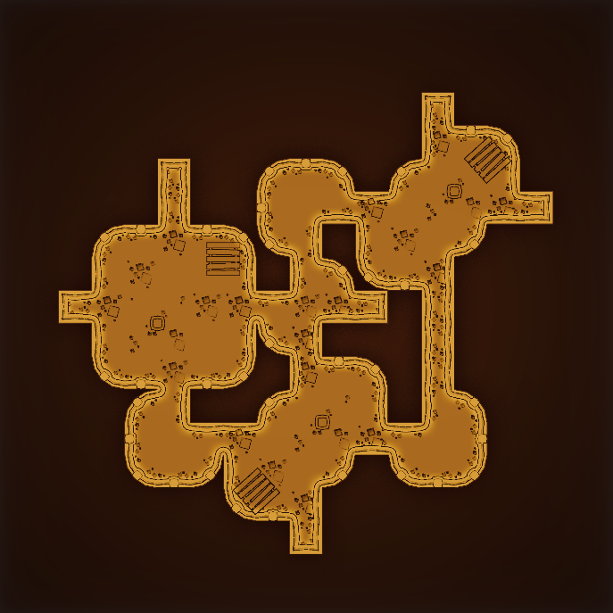
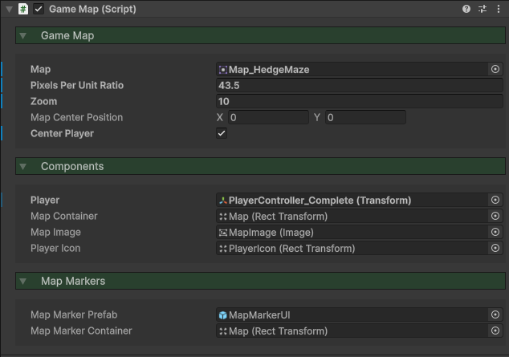

icon: material/map-outline

# :material-map-outline: Minimap

Minimaps can help players navigate your game world, displaying the player, their orientation, as well as [Navigation Markers](../navigation/navigation-markers.md). They can be customized with different map textures, borders, icon design, and more.

<iframe width="854" height="480" src="https://www.youtube.com/embed/23kqOB_sZpE" frameborder="0" allow="accelerometer; autoplay; encrypted-media; gyroscope; picture-in-picture" allowfullscreen></iframe>

## Setup

### 1. Map Texture

Maps are textures which the minimap can render, move, and rotate. Here are some things you'll need to have in mind when creating your map texture:

* Ideally, have the scene origin in the centre of the texture.
* Figure out the *Pixels Per Unit Ratio*. This is how many pixels on the texture represent 1 unit in length.
* Make sure your texture is large enough, as it may need to be zoomed in on.
* Check out some of the sample map textures in the `Implementation > Demos > Showroom > Textures > Maps` folder.

!!! tip

    An easy way of getting a texture of your map, is to create an orthographic camera and point it down on your scene. Take a high-res screenshot, or capture segments of the scene and stitch them together. If you have Photoshop, you can open up the sample map textures to see what effects I added to produce the look you see above.

### 2. Prefab

In the `Implementation > Prefabs > Navigation` folder, drag the **Minimap** prefab into the scene.

Down in the **GameMap** component, you'll want to set a few properties.

1. Assign the map texture to `Map`.
2. Set the `Pixels Per Unit Ratio` to be the number of pixels that equal 1 unit.
3. Set the `Player` to be the Transform of the player you wish to track.

If your map texture is not centred, you can adjust the `Map Center Position` vector.

### 3. Navigation Markers

If you wish to display [Navigation Markers](../navigation/navigation-markers.md), check out the documentation for that, as they will be automatically rendered.

If you wish to change the size or properties of the UI markers themselves, modify the **MapMarkerUI** prefab, located in the `Core > Prefabs > UI > Navigation` folder.