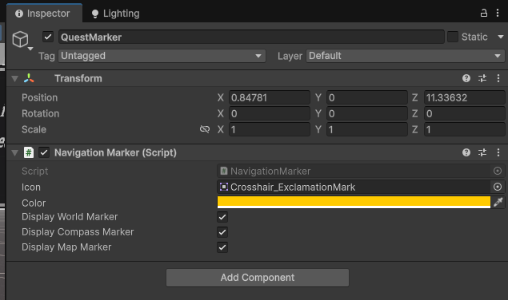

icon: material/map-marker-outline

# :material-map-marker-outline: Navigation Markers

Navigation markers are points in 3D space which can denote a specific location (quest objective, collectable, NPC, etc). These markers can then be displayed on compass bars, minimaps, and even rendered in the world.

## Navigation Marker Manager

In order for the markers to work, we need to include the **NavigationMarkerManager** in our scene. The prefab is located in the `Core > Prefabs > Systems > Management` folder.

This object acts as the registry for all markers in the scene. When a new one is initialized, it will automatically register itself with the manager, and unregister when destroyed. Navigation related systems, such as compass bars and minimaps, can read the list of markers to display them in their respective way.

## Creating a Navigation Marker

1. Create a new empty GameObject.
2. Attach the NavigationMarker component.
3. Set the properties to your liking.

As mentioned above, as long as you have a NavigationMarkerManager in your scene, the marker will automatically register itself upon initialization. This means you can also instantiate markers at runtime seamlessly.

