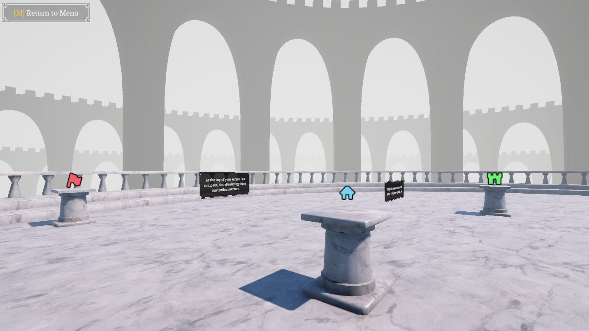

icon: material/map-marker-radius-outline

# :material-map-marker-radius-outline: World Markers

This system renders [Navigation Markers](navigation-markers.md) on-screen via a canvas. The markers track to their position, and can scale/fade depending on the distance.

## Setup

This system is managed by the **NavigationWorldMarkerManager**. The prefab can be found in the `Core > Prefabs > Systems > Management` folder. Drag that into your scene and you should be good to go!

!!! note

    This will require a [NavigationManager](navigation-markers.md#navigation-marker-manager) as well in order to keep track of the markers placed in the world.

## Marker Properties

The **NavigationWorldMarkerManager** GameObject has a canvas as a child. This is where the world marker UI elements will be housed. If you want to change the look of these world markers, you can modify the **NavigationWorldMarkerUI** prefab in the `Core > Prefabs > UI` folder.

In the Inspector, you can implement both **fade over distance** and/or **scale over distance**. You can set a start and end distance, as well as a falloff curve.

(INCLUDE IMAGE OF THE COMPONENT IN THE INSPECTOR)