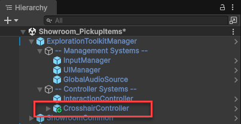
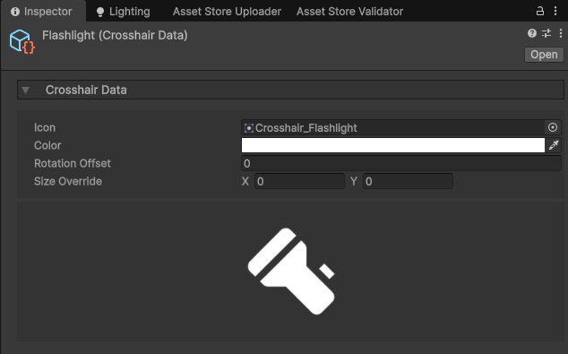

icon: material/crosshairs

# :material-crosshairs: Crosshairs

You can create a dynamic crosshair that changes depending on what you're looking at, and the different types of interactions you may invoke.

## Setup

Crosshairs are controlled via the **CrosshairController** component and a canvas for rendering.

You can find the prefab in the `Core > Prefabs > Player Systems` folder. Drag that into your scene as a child of the **ExplorationToolkitManager**.

Selecting the CrosshairController, you can define some settings.

* **Use as Mouse Cursor** - When the mouse is enabled (e.g. when inspecting, in menus), the crosshair will act as the mouse cursor.
* **Image** - The UI image component where the crosshair will be rendered.
* **Default Crosshair** - The crosshair that will be visible by default. If you want no crosshair by default, set this to nothing.

## Creating a Crosshair

Each crosshair type is stored in a **CrosshairData** ScriptableObject.

1. In the Project window, right click and select: `Create > Exploration Toolkit > Crosshair Data`.
2. In the Inspector, assign a sprite and modify the properties as you see fit.

If you wish for this to be the default crosshair:

* Select the **CrosshairController** object, and assign it to the *Default Crosshair* property.

## Dynamic Crosshair

The crosshair system is dynamic, meaning it will change depending on what you're looking at. This happens according to the interaction system. When you look at an Interactable, your crosshair can/will change.