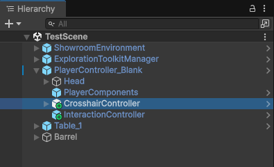
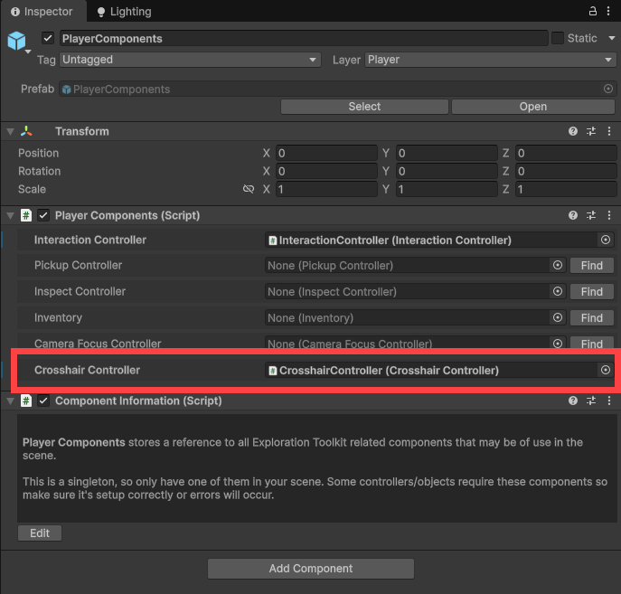
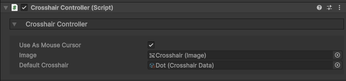
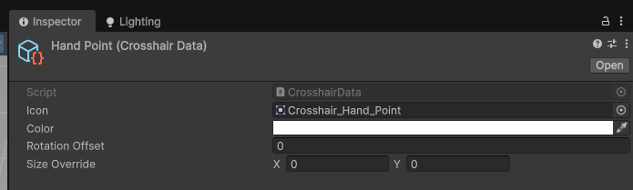

icon: material/crosshairs

# :material-crosshairs: Crosshairs

You can create a dynamic crosshair that changes depending on what you're looking at, and the different types of interactions you may invoke.

## Setup

Crosshairs are controlled via the **CrosshairController** component and a canvas for rendering.

I recommend using the **CrosshairController** prefab `Core > Prefabs > Player Systems`, as this has everything setup for you and is customizable. Drag that into your scene, ideally as a child of your player.

Your player controller should have a **PlayerComponents** object. Assign the crosshair controller to the respective property field.

Then inside the crosshair controller, you can set the default crosshair.

## Creating a Crosshair

Each crosshair type is stored in a **CrosshairData** ScriptableObject.

1. In the Project window, right click and select: `Exploration Toolkit > Crosshair Data`.

2. In the Inspector, assign a sprite and modify the properties as you see fit.

If you wish for this to be the default crosshair:

* Select the **CrosshairController** object, and assign it to the *Default Crosshair* property.

## Dynamic Crosshair

The crosshair system is dynamic, meaning it will change depending on what you're looking at. This happens according to the interaction system. When you look at an Interactable, your crosshair can/will change.