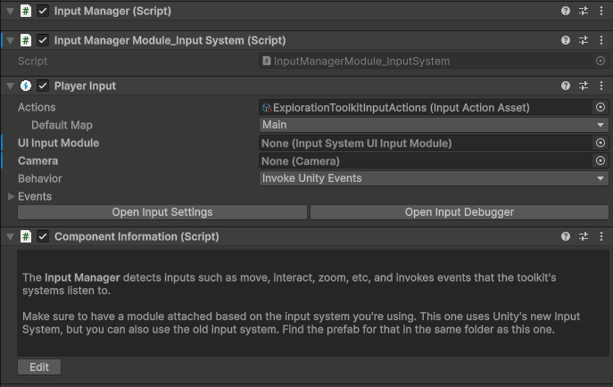
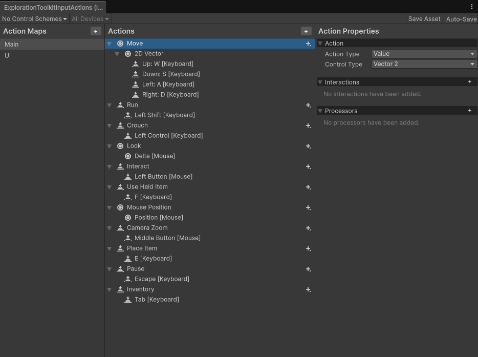

# Input Manager

The toolkit uses a custom input manager. It registers inputs via whatever system you wish, then outputs events that the toolkit's components can listen to.

This is **required**. By default, there's support for Unity's new and old input systems. If you are using a 3rd party solution such as Rewired, you can still create a custom module script which interfaces with the input manager.

!!! tip "The overall purpose"

    The input manager acts as a wrapper for any input system. This means you don't need to know how to send inputs to the player, or the interaction system. That's all done for you.

## Implementing

Every scene with player inputs requires the input manager.

Go to the `Core > Prefabs > Managers` folder and you will find 2 prefabs.

* **InputManager** - Detect inputs from Unity's new input system (default as of Unity 6).

* **InputManager_OldInputSystem** - Detect inputs from the legacy input manager.

Whichever one you're using, drag it into the scene.



If you're using the new input system, you can view/modify the Input Action Asset, located in the `Core > Input` Actions folder.



## Properties, Events & Methods

The InputManager singleton (`InputManager.Instance`) has properties you can access, events you can listen to, and methods you can call.

### Properties

* `bool PlayerInputDisabled`
* `Vector2 MousePosition`
* `float MouseScrollWheel`
* `float SmoothMouseScrollWheel`
* `Vector2 MouseDelta`
* `bool CursorVisible`
* `bool CursorLocked`

### Events

* `OnMove (Vector2)`
* `OnRun (InputPhase)`
* `OnCrouch (InputPhase)`
* `OnInteract (InputPhase)`
* `OnUseHeldItem (InputPhase)`
* `OnPlaceItem (InputPhase)`
* `OnCameraZoom (InputPhase)`
* `OnLeftMouseButton (InputPhase)`
* `OnRightMouseButton (InputPhase)`
* `OnPause (InputPhase)`
* `OnInventory (InputPhase)`

The **InputPhase** enum has 3 possible values: `Pressed` `Released` `None`

### Methods

* `EnableCursor (bool cursorVisibility)`
* `DisableCursor ()`
* `ResetCursorState ()`
* `EnablePlayerInput ()`
* `DisablePlayerInput ()`
* `ResetPlayerInput ()`

## Modules

The input manager works on a modular system, meaning, the base InputManager script doesn't know what input system you're using (new, old, Rewired, etc). All it does is emit events once corresponding functions are called.

The module scripts are what detect the inputs from your respective input system. You'll see that the toolkit has two, one for the new input system, and one for the old.

### Creating a module

If you're using a 3rd part or custom input system such as Rewired, you can easily connect that to the toolkit's InputManager.

1. Create a module script, inheriting from `InputManagerModuleBase`.

    ```csharp
    namespace ExplorationToolkit
    {
        public class InputManagerModule_CustomInputSystem : InputManagerModuleBase
        {
        
        }
    }
    ```

2. Detect your inputs however you like. You can connect them to the InputManager by accessing the protected `inputManager` variable. For example, here's how to update the mouse position with the new input system.

    ```csharp
    inputManager.SetMousePosition(Mouse.current.position.value);
    ```

3. For a complete input module, I recommend calling these functions on the InputManager.

    * `MoveInput (Vector2 input)`
    * `RunInput (InputPhase inputPhase)`
    * `CrouchInput (InputPhase inputPhase)`
    * `InteractInput (InputPhase inputPhase)`
    * `UseHeldItemInput (InputPhase inputPhase)`
    * `PlaceItemInput (InputPhase inputPhase)`
    * `CameraZoomInput (InputPhase inputPhase)`
    * `LeftMouseButtonInput (InputPhase inputPhase)`
    * `RightMouseButtonInput (InputPhase inputPhase)`
    * `PauseInput (InputPhase inputPhase)`
    * `InventoryInput (InputPhase inputPhase)`
    * `SetMousePosition (Vector2 pos)`
    * `SetMouseScrollWheel (float value)`
    * `SetMouseDelta (Vector2 delta)`

If you're having any issure with setting up an input module, simply have a look a the two existing ones.