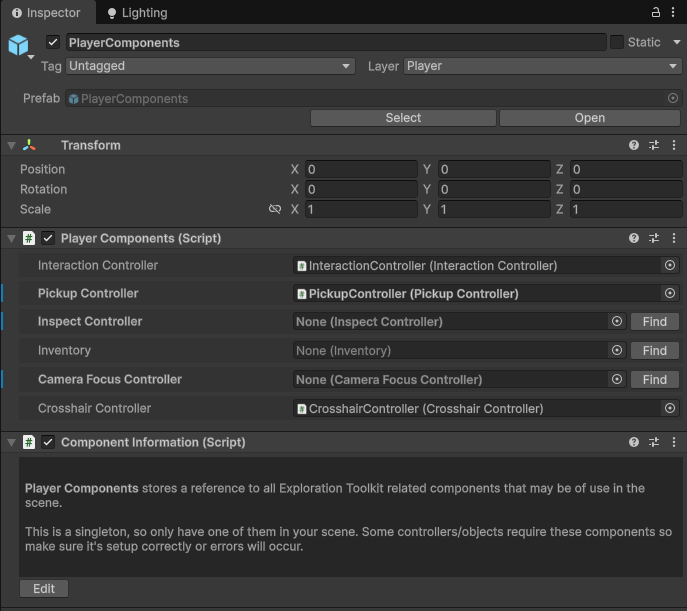

# Player Components

Many of the systems (i.e. interaction, pickup, inspect) require references between one another. For example, the inventory requires a reference to the pickup controller, as when we equip items from the inventory, that is done via the pickup system.

So instead of having to drag and drop a reference for each component to one another, we have a centralized object which manages them all.

* The **PlayerComponents** prefab can be found in the `Core > Prefabs > Managers` folder.

When you add a new controller into the scene, make sure you assign a reference to it here. You can click the "Find" button to automatically search the scene for the corresponding component.

