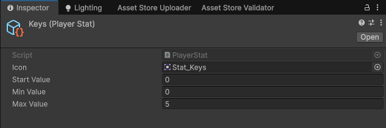
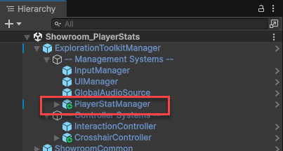
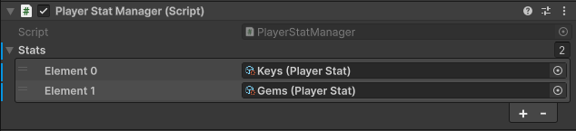
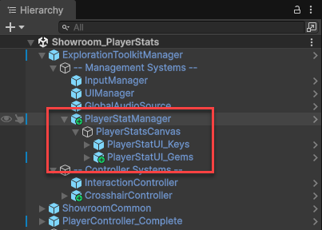
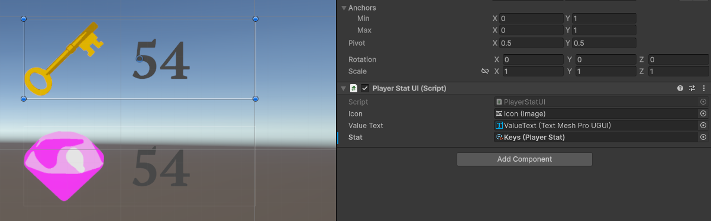
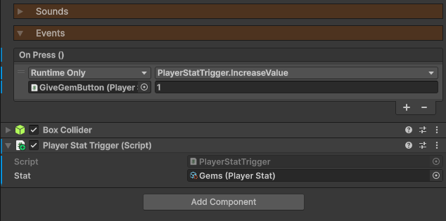

icon: material/chart-box-outline

# :material-chart-box-outline: Player Stats

Player stats can be used to keep track of coins, keys, items, and other collectables. A stat can also act as a key in unlocking [Doors](../mechanisms/doors.md), or as the means in allowing the player to attempt [Lockpicking](../locks-lockpicking/lockpicking.md).

<iframe width="854" height="480" src="https://www.youtube.com/embed/6xbCfdZtJcY" frameborder="0" allow="accelerometer; autoplay; encrypted-media; gyroscope; picture-in-picture" allowfullscreen></iframe>

## Creating a Stat

A stat is represented via a ScriptableObject. To create one, right click in the Project window and go `Create > Exploration Toolkit > Player Stat`. Give the file a name, then you can fill in the properties.

This is merely an object that represents the rules and icon of the stat. It doesn't hold the stat value. That's controlled by the **PlayerStatManager**.

## Player Stat Manager

If you wish to use player stats in your scene, drag in the **PlayerStatManager** prefab, located in the `Core > Prefabs > Systems > Management` folder into your scene as a child of the **ExplorationToolkitManager**.

In the Inspector, add to the list all the stats you wish to use in the scene.

There is a canvas as a child of the manager. This is where the stats are rendered on-screen for the player to keep track of. You don't have to store them here, it's just a convenient place.

Use and duplicate the template GameObject - however many stats you wish to display on-screen.

For each **PlayerStatUI**, position it in the canvas, and assign a stat to the `Stat` property. At the start of the game, this component will automatically connect to the PlayerStatManager and display the current value of the stat. Whenever the value changes, so too will the text.

## Player Stat Trigger

If you want a way of increasing or decreasing a stat, and don't wish to write a custom script, you can use the **PlayerStatTrigger** component.

* Assign a stat to the `Stat` property.
* Then via a button, interaction, whatever, call either the `IncreaseValue()` or `DecreaseValue()` function, sending over an amount.

In the example below, I have a [PressableButton](../mechanisms/buttons.md) which increases the *Gem* stat by 1 each time it's pressed.

## Scripting

You can also interact with the stats via scripting. Do note, that you won't be interacting with the **Stat** ScriptableObject files directly. Only the **PlayerStatManager**.

Here are some handy functions you can call on the **PlayerStatManager**:

* `IncreaseStatValue (PlayerStat stat, int amount)` - Increases the given stat by an amount.
* `DecreaseStatValue (PlayerStat stat, int amount)` - Decreases the given stat by an amount.
* `HasStat (PlayerStat stat)` - Returns true if the given stat is in the `stats` list.
* `StatValue (PlayerStat stat)` - Returns the current value of the given stat.
