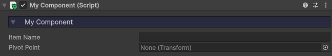
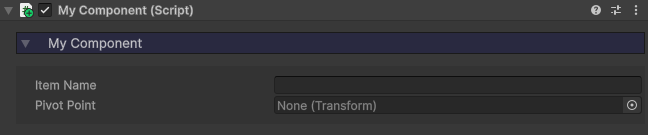

# :material-list-box-outline: Custom Inspectors

Many of the toolkit's components have associated custom editor scripts. This allows control of how the properties are rendered in the Inspector, as well as decoration, such as foldouts, colours, warning messages, and buttons.

## Modifying script variables

If you're modifying existing scripts, be careful, as by default adding new variables won't render them in the Inspector, and changing the names of existing variables may cause the Inspector to log errors.

!!! question "Why?"

    The custom inspector scripts serialize properties not with their name, but with a string. When you change the name of a variable in the **Door** script for example, you will also need to change the property that's being serialized in the **DoorInspector** script.

## Creating a custom inspector

If you are creating your own components and wish to implement a component interface similar to the one in the toolkit, follow these steps:

1. Create a new script for the custom inspector in the `Core > Editor > Custom Inspectors` folder. Call it something like MyComponentInspector.

2. Setup your script as seen below. The `ExplorationToolkitBaseInspector` class has a number of functions we'll be calling to format our component.

    ```csharp
    using UnityEngine;
    using UnityEditor;

    namespace ExplorationToolkit.Editors
    {
        [CustomEditor(typeof(MyComponent))]
        [CanEditMultipleObjects]
        public class MyComponentInspector : ExplorationToolkitBaseInspector
        {
            
        }
    }
    ```

3. Create the `OnEnable` function, and register all the properties you wish to draw using the `AddProperty` function.

    ```csharp
    void OnEnable ()
    {
        AddProperty("itemName");
        AddProperty("pivot");
    }
    ```

4. Override the parent class' `headerTheme` variable. This determines what color the foldouts are. If you wish to follow the colour-coded conventions, open the parent class and there will be comments next to the enumerator definition.

    ```csharp
    protected override ThemeColor headerTheme => ThemeColor.Blue;
    ```

5. For all the different foldouts you wish to implement, create private static variables for their state.

    ```csharp
    private static bool mainFoldout = true;
    private static bool advancedFoldout = true;
    ```

6. Finally, override the parent's `RenderGUI` function. This is where we will draw the properties, foldouts, etc.

    ```csharp
    protected override void RenderGUI ()
    {
        
    }
    ```

7. To create a foldout, call the `DrawFoldout` function and set that to be the value of the respective static variable. This will toggle true or false when clicked on. Then if that foldout is true, draw its properties.

    ```csharp
    mainFoldout = DrawFoldout(mainFoldout, "My Component");

    if(mainFoldout)
    {

    }
    ```

8. To draw a property, call the `DrawProperty` function, with the property name as the parameter. Optionally, you can send a second string parameter to override the name displayed.

    ```csharp
    DrawProperty("itemName");
    DrawProperty("pivot", "Pivot Point");
    ```

    

9. If you wish to have boxes separating properties within foldouts, add the `BeginBox` and `EndBox` functions.

    ```csharp
    BeginBox();
    DrawProperty("itemName");
    DrawProperty("pivot", "Pivot Point");
    EndBox();
    ```

    
