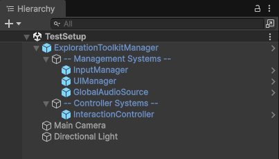

icon: material/creation-outline

# :material-creation-outline: Scene Setup

In each scene, you must add the **ExplorationToolkitManager**. This is the brain of the toolkit.

## Exploration Toolkit Manager

The toolkit is built upon the idea of *systems*. There are many systems, such as: inspecting objects, crosshairs, compass bars, lockpicking, etc. These systems are all managed by the [ETSystemRegistry](../scripting/etsystemregistry.md), which allows objects in the scene to easily access whatever system they desire.

* Add the **ExplorationToolkitManager** to your scene, located in the `Core > Prefabs` folder.

If you look inside the GameObject, you'll see 2 sections:

* **Management Systems** - These are components which manage/connect other systems. Things like detecting inputs, or managing audio.
* **Controller Systems** - These are the actual gameplay systems. Things like interaction, crosshairs, lockpicking, etc.

You'll notice that the prefab comes with some system already added. They're not required (you can always delete them), but these are systems you'll likey have in every gameplay scene.

All the different systems you can add to your scene can be found in the `Core > Prefabs > Systems` folder.

!!! help "Learning the toolkit"

    In learning the toolkit's systems, I recommend starting with the [Interaction System](../interaction/basic-setup.md).

## Optional Things

If you are implementing a menu with settings, add the [ExplorationToolkitGameSettings](../scripting/etgamesettings.md) prefab to your initial scene, located in the `Core > Prefabs` folder. This loads settings from the PlayerPrefs for other components to read, and for the settings screen to modify.