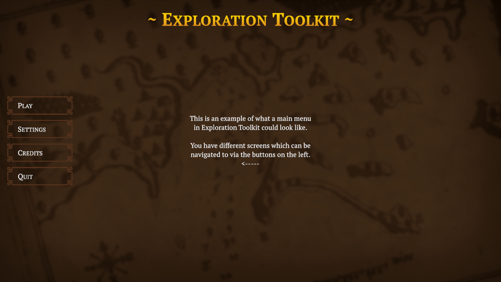
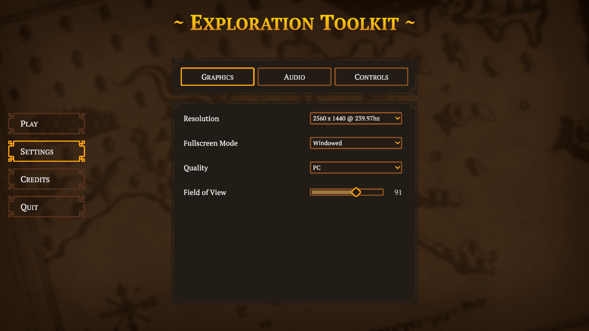
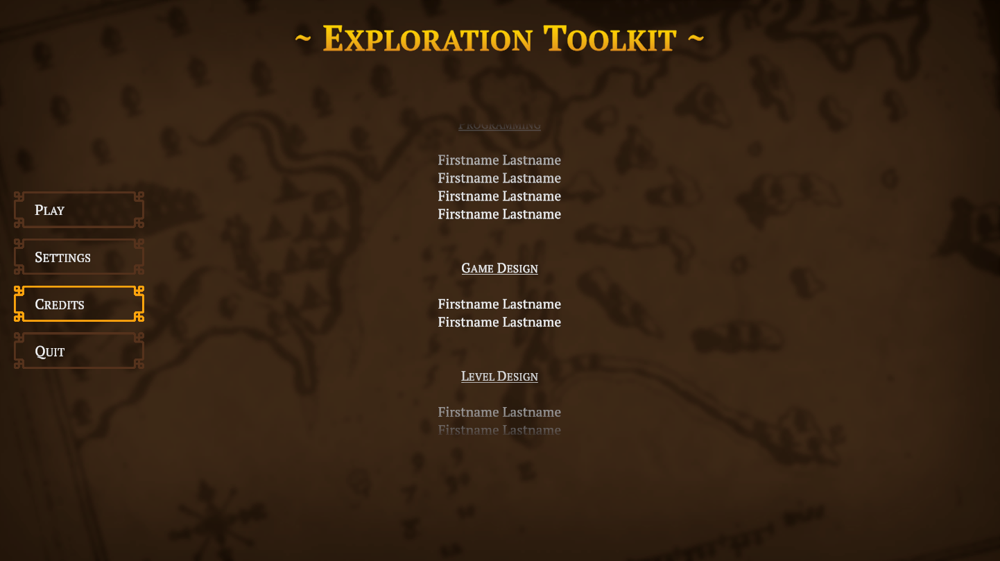
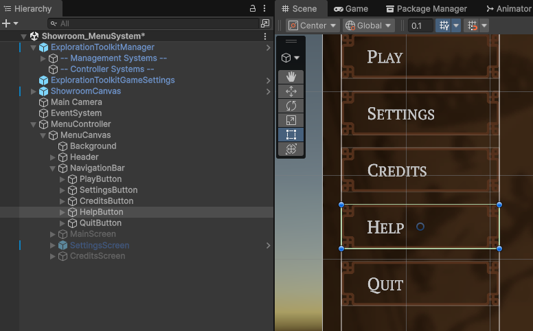
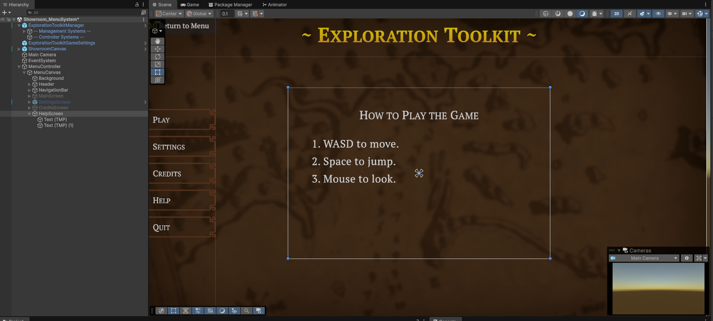
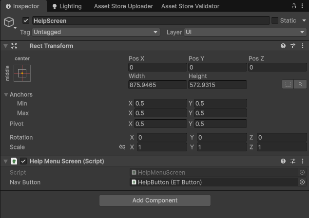
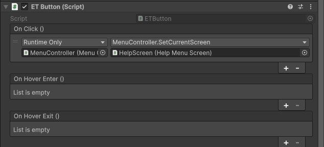
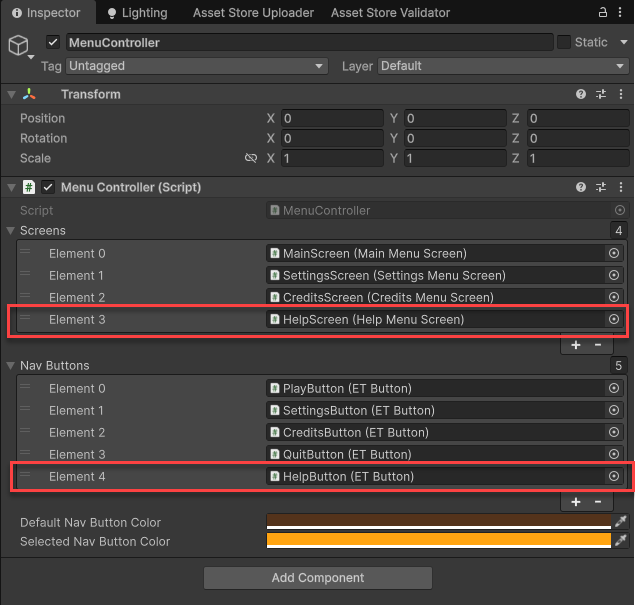

icon: material/menu

# :material-menu: Menu

The toolkit features a complete menu system ready to be used in-game. The highlight of the menu is the **settings screen**, which allows the player to adjust their graphics, audio, and control settings.

!!! note
    Check out the menu template in the **Showroom_MenuSystem** demo scene, in the `Implementation > Demos > Showroom > Scenes` folder.



## Screens

The menu is divided up into a number of screens. The demo comes with a few screen templates for you to use and expand upon.

### Settings Screen

This is the main attraction. Here, you can modify graphical, audio, and control settings. I recommend diving into the setting page related scripts to see how this is setup.

In the menu scene, you'll notice the **ExplorationToolkitGameSettings** prefab. This is a persistent object which loads in the settings from PlayerPrefs and manages their current state. When you adjust the FOV slider, that value is sent to the [ETGameSettings](../scripting/etgamesettings.md) component on the prefab, where the setting is updated, saved to PlayerPrefs, then invoked as an event for components which may want to know when a certain setting has been changed.



### Credits Screen

This is an automatic scrolling credits screen. Modify the text component and add whatever you like to the *Content* child object. You can also adjust the scroll speed.



### Creating a Screen

Let's say you want to add a *Help* screen to the menu, where the player might get a quick rundown on how the game works.

1. Create a new script. Add it to the `ExplorationToolkit.Menu` namespace, and inherit from `BaseMenuScreen`.

    ```csharp
    namespace ExplorationToolkit.Menu
    {
        public class HelpMenuScreen : BaseMenuScreen
        {
            // Add any initialization code to the OnEnable() function.
        }
    }
    ```

2. Create a navigation button on the left side panel.

    

3. Create an empty GameObject for the screen and fill it with your content.

    

4. Attach the script as a component, then reference its associated nav button.

    

5. Select the nav button again, and down in the ETButton component's `OnClick` event, connect that to the MenuController's `SetCurrentScreen()` function, sending over your new window component.

    

6. Finally, select the **MenuController** and add both the screen and nav button to their respective lists. Screen 0 is what gets set at the start of the game.

    