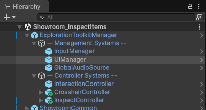
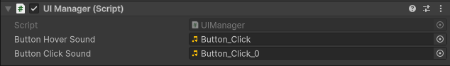
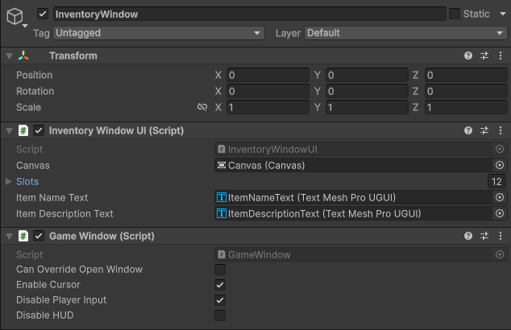
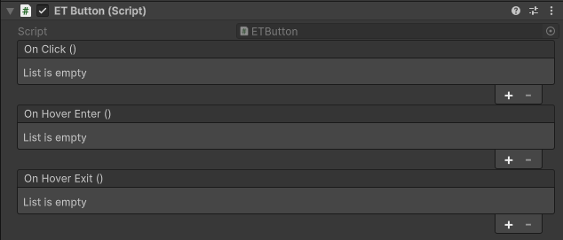

icon: material/monitor-screenshot

# :material-monitor-screenshot: UI Manager

The **UI Manager** acts as the central point for controlling which window is currently open (inspect screen, inventory window, etc), and toggling the HUD. It also manages sound effects for buttons.

By default, the **UIManager** is included in the **ExplorationToolkitManager**, so there's no need to manually add it.

On the component itself, you can assign some button sound effects. These are triggered when hovering and clicking on an **ETButton**, the toolkit's custom button implementation.

## Game Window

If you have a window in-game you wish to open (e.g. inspect screen, inventory window), the process of doing so is controlled by the **UIManager**. A window is represented by a **GameWindow** component.

On the **InventoryWindow** prefab, you will see the GameWindow component attached. This is what's sent over to the UIManager when it wants to open. Upon opening, the UIManager reads its properties and makes adjustments if needed.

* `Can Override Open Window` will cause any currently open window to close. If false and other window is open, this one will not open.
* `Enable Cursor` will enable the mouse cursor when the window opens.
* `Disable Player Input` will disable all movement and interaction inputs, preventing the player from moving, looking, etc.
* `Disable HUD` will disable all HUD elements (hotbar inventory, compass bar) when the window opens. This is good for full-screen windows like the inspect screen.

## ETButton

**ETButton** is a component which replaces Unity's existing **Button**. It has events for `OnClick`, `OnHoverEnter`, and `OnHoverExit`. When hovered and clicked, it will play sound effects from the UIManager, via the [Global Audio Source](../scripting/global-audio-source.md).

The button also has a scale adjustment when hovering and clicking to improve visual feedback. All the button elements in the toolkit use this custom implementation. There will also be improvements to it in the future, adding more features and quality of life things.

